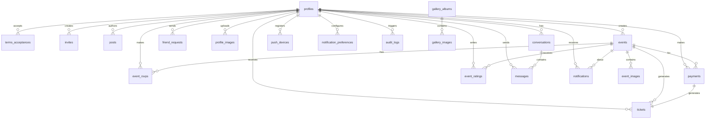
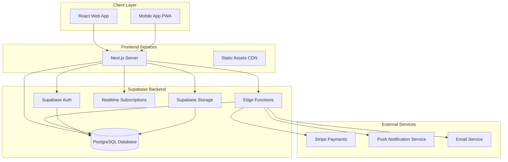
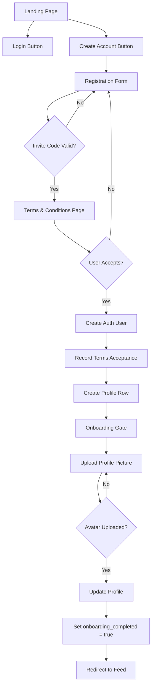
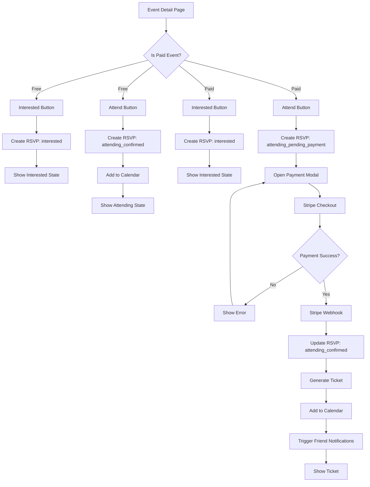
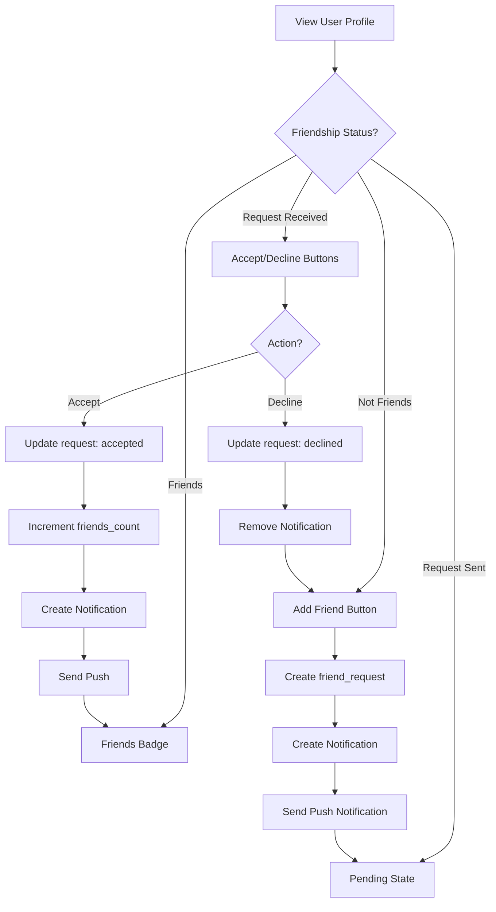
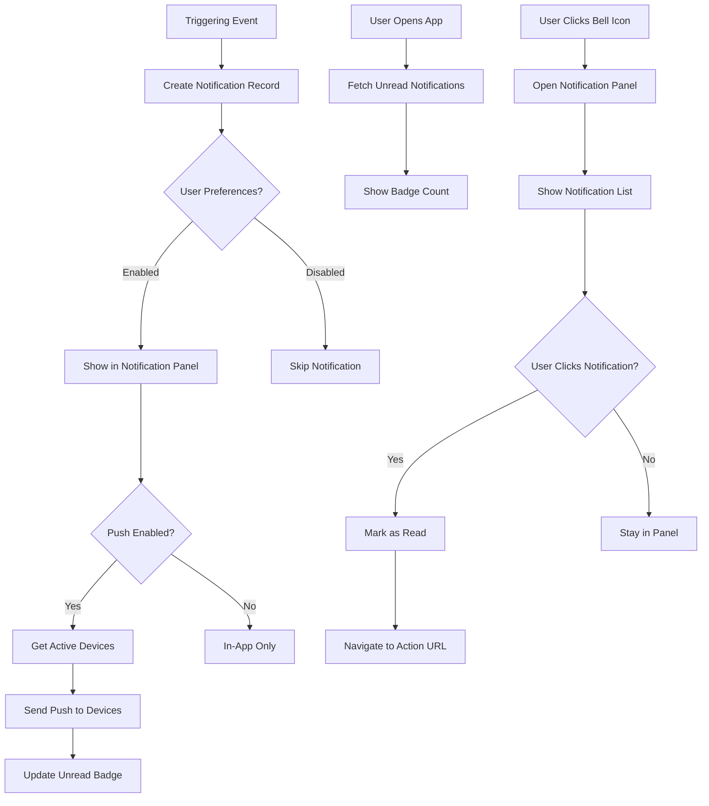
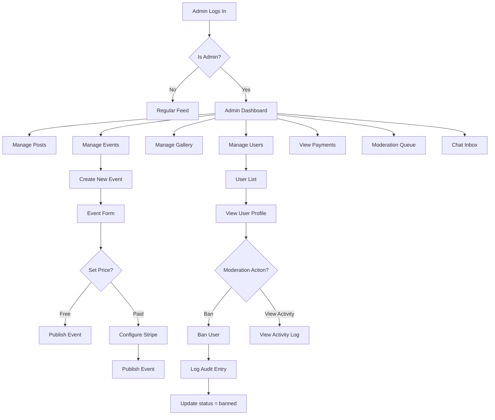
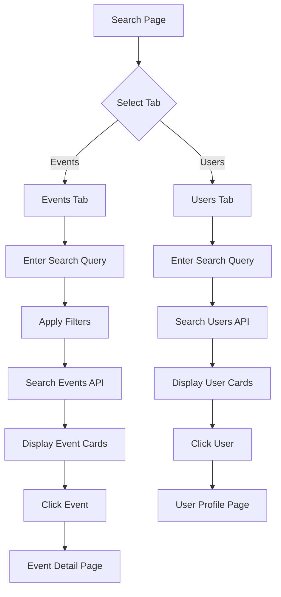
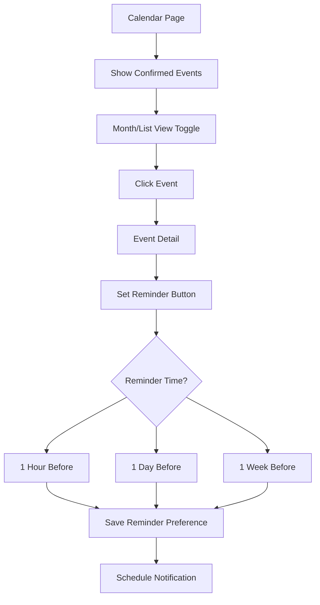

# Rendezvous Social Club — Technical Specification
**React + Tailwind + Supabase**

---

## Table of Contents
1. [Database Schema](#database-schema)
2. [Folder Structure](#folder-structure)
3. [Architecture Overview](#architecture-overview)
4. [RLS Policies](#rls-policies)
5. [Storage Buckets](#storage-buckets)
6. [API Specifications](#api-specifications)
7. [UI/UX Flows](#uiux-flows)
8. [Implementation Guidelines](#implementation-guidelines)

---

## Database Schema

### Entity Relationship Diagram



### Core Tables

#### `profiles`
User profile information (extends Supabase auth.users).

```sql
CREATE TABLE profiles (
  id UUID PRIMARY KEY REFERENCES auth.users(id) ON DELETE CASCADE,
  created_at TIMESTAMPTZ NOT NULL DEFAULT NOW(),
  updated_at TIMESTAMPTZ NOT NULL DEFAULT NOW(),
  
  -- Identity
  email TEXT NOT NULL UNIQUE,
  username TEXT NOT NULL UNIQUE,
  full_name TEXT NOT NULL,
  bio TEXT,
  
  -- Media (required avatar, optional custom hero)
  avatar_url TEXT NOT NULL,
  hero_image_url TEXT, -- null = use default sunset
  
  -- Status & Moderation
  status TEXT NOT NULL DEFAULT 'active' CHECK (status IN ('active', 'suspended', 'banned')),
  role TEXT NOT NULL DEFAULT 'member' CHECK (role IN ('member', 'admin')),
  
  -- Privacy & Preferences
  share_attendance_with_friends BOOLEAN NOT NULL DEFAULT true,
  
  -- Onboarding
  onboarding_completed BOOLEAN NOT NULL DEFAULT false,
  
  -- Metadata
  last_seen_at TIMESTAMPTZ,
  events_attended_count INTEGER NOT NULL DEFAULT 0,
  friends_count INTEGER NOT NULL DEFAULT 0
);

CREATE INDEX idx_profiles_username ON profiles(username);
CREATE INDEX idx_profiles_status ON profiles(status);
CREATE INDEX idx_profiles_role ON profiles(role);
CREATE INDEX idx_profiles_email ON profiles(email);
```

#### `invites`
Invite codes for registration (invite-only system).

```sql
CREATE TABLE invites (
  id UUID PRIMARY KEY DEFAULT gen_random_uuid(),
  created_at TIMESTAMPTZ NOT NULL DEFAULT NOW(),
  
  -- Invite code
  code TEXT NOT NULL UNIQUE,
  
  -- Usage tracking
  max_uses INTEGER NOT NULL DEFAULT 1,
  uses_count INTEGER NOT NULL DEFAULT 0,
  
  -- Validity
  expires_at TIMESTAMPTZ,
  is_active BOOLEAN NOT NULL DEFAULT true,
  
  -- Creator
  created_by UUID REFERENCES profiles(id) ON DELETE SET NULL,
  
  -- Notes
  notes TEXT
);

CREATE INDEX idx_invites_code ON invites(code);
CREATE INDEX idx_invites_active ON invites(is_active) WHERE is_active = true;
```

#### `terms_acceptances`
Records user acceptance of Terms & Conditions.

```sql
CREATE TABLE terms_acceptances (
  id UUID PRIMARY KEY DEFAULT gen_random_uuid(),
  created_at TIMESTAMPTZ NOT NULL DEFAULT NOW(),
  
  -- User
  user_id UUID NOT NULL REFERENCES profiles(id) ON DELETE CASCADE,
  
  -- Terms version
  version TEXT NOT NULL, -- e.g., '2026-01-01'
  
  -- Tracking
  accepted_at TIMESTAMPTZ NOT NULL DEFAULT NOW(),
  ip_address TEXT,
  user_agent TEXT
);

CREATE INDEX idx_terms_user_id ON terms_acceptances(user_id);
CREATE INDEX idx_terms_version ON terms_acceptances(version);
```

---

### Content Tables

#### `posts`
Admin-created newsfeed posts (announcements, offers, promotions).

```sql
CREATE TABLE posts (
  id UUID PRIMARY KEY DEFAULT gen_random_uuid(),
  created_at TIMESTAMPTZ NOT NULL DEFAULT NOW(),
  updated_at TIMESTAMPTZ NOT NULL DEFAULT NOW(),
  
  -- Content
  title TEXT NOT NULL,
  content TEXT NOT NULL,
  excerpt TEXT,
  
  -- Media
  cover_image_url TEXT,
  images JSONB, -- array of image URLs
  
  -- Type
  type TEXT NOT NULL CHECK (type IN ('announcement', 'offer', 'event_promotion')),
  
  -- Linked event (optional)
  event_id UUID REFERENCES events(id) ON DELETE SET NULL,
  
  -- Publishing
  published BOOLEAN NOT NULL DEFAULT false,
  published_at TIMESTAMPTZ,
  
  -- Author (admin)
  author_id UUID NOT NULL REFERENCES profiles(id) ON DELETE CASCADE,
  
  -- Display
  pinned BOOLEAN NOT NULL DEFAULT false,
  display_order INTEGER NOT NULL DEFAULT 0
);

CREATE INDEX idx_posts_published ON posts(published, published_at DESC);
CREATE INDEX idx_posts_type ON posts(type);
CREATE INDEX idx_posts_event_id ON posts(event_id);
CREATE INDEX idx_posts_author_id ON posts(author_id);
```

#### `events`
Club events (free or paid).

```sql
CREATE TABLE events (
  id UUID PRIMARY KEY DEFAULT gen_random_uuid(),
  created_at TIMESTAMPTZ NOT NULL DEFAULT NOW(),
  updated_at TIMESTAMPTZ NOT NULL DEFAULT NOW(),
  
  -- Content
  title TEXT NOT NULL,
  description TEXT NOT NULL,
  
  -- Timing
  start_time TIMESTAMPTZ NOT NULL,
  end_time TIMESTAMPTZ NOT NULL,
  timezone TEXT NOT NULL DEFAULT 'Europe/Madrid',
  
  -- Location
  location_name TEXT NOT NULL,
  location_address TEXT,
  location_coordinates POINT, -- PostGIS or simple POINT type
  
  -- Pricing
  price_eur DECIMAL(10,2) NOT NULL DEFAULT 0,
  currency TEXT NOT NULL DEFAULT 'EUR',
  
  -- Capacity
  capacity INTEGER,
  rsvp_interested_count INTEGER NOT NULL DEFAULT 0,
  rsvp_attending_count INTEGER NOT NULL DEFAULT 0,
  
  -- Media
  cover_image_url TEXT,
  images JSONB, -- array of image URLs
  
  -- Categorization
  category TEXT NOT NULL CHECK (category IN ('sports', 'exhibition', 'wine_tasting', 'party', 'dinner', 'networking', 'other')),
  tags TEXT[], -- array of tags
  
  -- Publishing
  published BOOLEAN NOT NULL DEFAULT false,
  published_at TIMESTAMPTZ,
  
  -- Status
  status TEXT NOT NULL DEFAULT 'scheduled' CHECK (status IN ('draft', 'scheduled', 'live', 'completed', 'cancelled')),
  cancelled_at TIMESTAMPTZ,
  cancellation_reason TEXT,
  
  -- Creator (admin)
  created_by UUID NOT NULL REFERENCES profiles(id) ON DELETE CASCADE,
  
  -- Ratings (aggregate)
  average_rating DECIMAL(3,2),
  ratings_count INTEGER NOT NULL DEFAULT 0
);

CREATE INDEX idx_events_published ON events(published, start_time);
CREATE INDEX idx_events_status ON events(status);
CREATE INDEX idx_events_category ON events(category);
CREATE INDEX idx_events_start_time ON events(start_time);
CREATE INDEX idx_events_created_by ON events(created_by);
```

#### `event_images`
Separate table for event images (for better management).

```sql
CREATE TABLE event_images (
  id UUID PRIMARY KEY DEFAULT gen_random_uuid(),
  created_at TIMESTAMPTZ NOT NULL DEFAULT NOW(),
  
  event_id UUID NOT NULL REFERENCES events(id) ON DELETE CASCADE,
  image_url TEXT NOT NULL,
  caption TEXT,
  display_order INTEGER NOT NULL DEFAULT 0
);

CREATE INDEX idx_event_images_event_id ON event_images(event_id, display_order);
```

---

### Event Interaction Tables

#### `event_rsvps`
User RSVPs to events (Interested or Attend).

```sql
CREATE TABLE event_rsvps (
  id UUID PRIMARY KEY DEFAULT gen_random_uuid(),
  created_at TIMESTAMPTZ NOT NULL DEFAULT NOW(),
  updated_at TIMESTAMPTZ NOT NULL DEFAULT NOW(),
  
  -- References
  event_id UUID NOT NULL REFERENCES events(id) ON DELETE CASCADE,
  user_id UUID NOT NULL REFERENCES profiles(id) ON DELETE CASCADE,
  
  -- RSVP status
  status TEXT NOT NULL CHECK (status IN (
    'interested',
    'attending_pending_payment',
    'attending_confirmed',
    'cancelled'
  )),
  
  -- Payment tracking (for paid events)
  requires_payment BOOLEAN NOT NULL DEFAULT false,
  payment_completed BOOLEAN NOT NULL DEFAULT false,
  
  -- Timestamps
  interested_at TIMESTAMPTZ,
  attending_at TIMESTAMPTZ,
  confirmed_at TIMESTAMPTZ,
  cancelled_at TIMESTAMPTZ,
  
  -- Unique constraint: one RSVP per user per event
  UNIQUE(event_id, user_id)
);

CREATE INDEX idx_rsvps_event_id ON event_rsvps(event_id, status);
CREATE INDEX idx_rsvps_user_id ON event_rsvps(user_id, status);
CREATE INDEX idx_rsvps_confirmed ON event_rsvps(event_id, user_id) WHERE status = 'attending_confirmed';
```

#### `event_ratings`
Post-event ratings by attendees.

```sql
CREATE TABLE event_ratings (
  id UUID PRIMARY KEY DEFAULT gen_random_uuid(),
  created_at TIMESTAMPTZ NOT NULL DEFAULT NOW(),
  updated_at TIMESTAMPTZ NOT NULL DEFAULT NOW(),
  
  -- References
  event_id UUID NOT NULL REFERENCES events(id) ON DELETE CASCADE,
  user_id UUID NOT NULL REFERENCES profiles(id) ON DELETE CASCADE,
  
  -- Rating
  rating INTEGER NOT NULL CHECK (rating >= 1 AND rating <= 5),
  review TEXT,
  
  -- Moderation
  is_visible BOOLEAN NOT NULL DEFAULT true,
  flagged BOOLEAN NOT NULL DEFAULT false,
  
  -- Unique constraint: one rating per user per event
  UNIQUE(event_id, user_id)
);

CREATE INDEX idx_ratings_event_id ON event_ratings(event_id) WHERE is_visible = true;
CREATE INDEX idx_ratings_user_id ON event_ratings(user_id);
```

---

### Payment & Ticketing Tables

#### `payments`
Payment records for paid events (Stripe integration).

```sql
CREATE TABLE payments (
  id UUID PRIMARY KEY DEFAULT gen_random_uuid(),
  created_at TIMESTAMPTZ NOT NULL DEFAULT NOW(),
  updated_at TIMESTAMPTZ NOT NULL DEFAULT NOW(),
  
  -- References
  user_id UUID NOT NULL REFERENCES profiles(id) ON DELETE CASCADE,
  event_id UUID NOT NULL REFERENCES events(id) ON DELETE CASCADE,
  rsvp_id UUID NOT NULL REFERENCES event_rsvps(id) ON DELETE CASCADE,
  
  -- Amount
  amount_eur DECIMAL(10,2) NOT NULL,
  currency TEXT NOT NULL DEFAULT 'EUR',
  
  -- Stripe
  stripe_payment_intent_id TEXT UNIQUE,
  stripe_charge_id TEXT,
  stripe_customer_id TEXT,
  
  -- Status
  status TEXT NOT NULL CHECK (status IN (
    'pending',
    'processing',
    'succeeded',
    'failed',
    'refunded',
    'cancelled'
  )),
  
  -- Timestamps
  paid_at TIMESTAMPTZ,
  refunded_at TIMESTAMPTZ,
  
  -- Metadata
  metadata JSONB
);

CREATE INDEX idx_payments_user_id ON payments(user_id);
CREATE INDEX idx_payments_event_id ON payments(event_id);
CREATE INDEX idx_payments_rsvp_id ON payments(rsvp_id);
CREATE INDEX idx_payments_stripe_intent ON payments(stripe_payment_intent_id);
CREATE INDEX idx_payments_status ON payments(status);
```

#### `tickets`
Generated tickets after successful payment.

```sql
CREATE TABLE tickets (
  id UUID PRIMARY KEY DEFAULT gen_random_uuid(),
  created_at TIMESTAMPTZ NOT NULL DEFAULT NOW(),
  
  -- References
  user_id UUID NOT NULL REFERENCES profiles(id) ON DELETE CASCADE,
  event_id UUID NOT NULL REFERENCES events(id) ON DELETE CASCADE,
  payment_id UUID NOT NULL REFERENCES payments(id) ON DELETE CASCADE,
  
  -- Ticket details
  ticket_number TEXT NOT NULL UNIQUE,
  qr_code_url TEXT,
  
  -- Status
  status TEXT NOT NULL DEFAULT 'valid' CHECK (status IN ('valid', 'used', 'refunded', 'cancelled')),
  
  -- Check-in
  checked_in BOOLEAN NOT NULL DEFAULT false,
  checked_in_at TIMESTAMPTZ,
  checked_in_by UUID REFERENCES profiles(id)
);

CREATE INDEX idx_tickets_user_id ON tickets(user_id);
CREATE INDEX idx_tickets_event_id ON tickets(event_id);
CREATE INDEX idx_tickets_payment_id ON tickets(payment_id);
CREATE INDEX idx_tickets_number ON tickets(ticket_number);
```

---

### Social Tables

#### `friend_requests`
Friend requests and friendships.

```sql
CREATE TABLE friend_requests (
  id UUID PRIMARY KEY DEFAULT gen_random_uuid(),
  created_at TIMESTAMPTZ NOT NULL DEFAULT NOW(),
  updated_at TIMESTAMPTZ NOT NULL DEFAULT NOW(),
  
  -- Users
  requester_id UUID NOT NULL REFERENCES profiles(id) ON DELETE CASCADE,
  recipient_id UUID NOT NULL REFERENCES profiles(id) ON DELETE CASCADE,
  
  -- Status
  status TEXT NOT NULL DEFAULT 'pending' CHECK (status IN ('pending', 'accepted', 'declined', 'cancelled')),
  
  -- Timestamps
  responded_at TIMESTAMPTZ,
  
  -- Constraint: no duplicate requests
  UNIQUE(requester_id, recipient_id),
  CHECK (requester_id != recipient_id)
);

CREATE INDEX idx_friend_requests_recipient ON friend_requests(recipient_id, status);
CREATE INDEX idx_friend_requests_requester ON friend_requests(requester_id, status);
CREATE INDEX idx_friend_requests_accepted ON friend_requests(requester_id, recipient_id) WHERE status = 'accepted';
```

#### `profile_images`
User profile gallery images.

```sql
CREATE TABLE profile_images (
  id UUID PRIMARY KEY DEFAULT gen_random_uuid(),
  created_at TIMESTAMPTZ NOT NULL DEFAULT NOW(),
  
  -- Owner
  user_id UUID NOT NULL REFERENCES profiles(id) ON DELETE CASCADE,
  
  -- Image
  image_url TEXT NOT NULL,
  caption TEXT,
  display_order INTEGER NOT NULL DEFAULT 0,
  
  -- Moderation
  is_visible BOOLEAN NOT NULL DEFAULT true,
  flagged BOOLEAN NOT NULL DEFAULT false
);

CREATE INDEX idx_profile_images_user_id ON profile_images(user_id, display_order);
```

---

### Gallery Tables (Admin-curated)

#### `gallery_albums`
Club gallery albums.

```sql
CREATE TABLE gallery_albums (
  id UUID PRIMARY KEY DEFAULT gen_random_uuid(),
  created_at TIMESTAMPTZ NOT NULL DEFAULT NOW(),
  updated_at TIMESTAMPTZ NOT NULL DEFAULT NOW(),
  
  -- Album details
  title TEXT NOT NULL,
  description TEXT,
  cover_image_url TEXT,
  
  -- Categorization
  category TEXT CHECK (category IN ('sports', 'exhibitions', 'wine_tastings', 'parties', 'dinners', 'venues', 'other')),
  
  -- Linked event (optional)
  event_id UUID REFERENCES events(id) ON DELETE SET NULL,
  
  -- Publishing
  published BOOLEAN NOT NULL DEFAULT false,
  published_at TIMESTAMPTZ,
  featured BOOLEAN NOT NULL DEFAULT false,
  
  -- Display
  display_order INTEGER NOT NULL DEFAULT 0,
  
  -- Creator (admin)
  created_by UUID NOT NULL REFERENCES profiles(id) ON DELETE CASCADE
);

CREATE INDEX idx_gallery_albums_published ON gallery_albums(published, display_order);
CREATE INDEX idx_gallery_albums_featured ON gallery_albums(featured) WHERE featured = true;
CREATE INDEX idx_gallery_albums_event_id ON gallery_albums(event_id);
```

#### `gallery_images`
Images within gallery albums.

```sql
CREATE TABLE gallery_images (
  id UUID PRIMARY KEY DEFAULT gen_random_uuid(),
  created_at TIMESTAMPTZ NOT NULL DEFAULT NOW(),
  
  -- Album
  album_id UUID NOT NULL REFERENCES gallery_albums(id) ON DELETE CASCADE,
  
  -- Image
  image_url TEXT NOT NULL,
  caption TEXT,
  
  -- Display
  display_order INTEGER NOT NULL DEFAULT 0,
  featured BOOLEAN NOT NULL DEFAULT false
);

CREATE INDEX idx_gallery_images_album_id ON gallery_images(album_id, display_order);
```

---

### Chat & Messaging Tables

#### `conversations`
Direct conversations between members and admins.

```sql
CREATE TABLE conversations (
  id UUID PRIMARY KEY DEFAULT gen_random_uuid(),
  created_at TIMESTAMPTZ NOT NULL DEFAULT NOW(),
  updated_at TIMESTAMPTZ NOT NULL DEFAULT NOW(),
  
  -- Participants
  member_id UUID NOT NULL REFERENCES profiles(id) ON DELETE CASCADE,
  
  -- Status
  status TEXT NOT NULL DEFAULT 'open' CHECK (status IN ('open', 'closed', 'archived')),
  
  -- Last message
  last_message_at TIMESTAMPTZ,
  last_message_preview TEXT,
  
  -- Unread counts
  unread_by_member INTEGER NOT NULL DEFAULT 0,
  unread_by_admin INTEGER NOT NULL DEFAULT 0,
  
  -- Unique constraint: one conversation per member
  UNIQUE(member_id)
);

CREATE INDEX idx_conversations_member_id ON conversations(member_id);
CREATE INDEX idx_conversations_updated ON conversations(updated_at DESC);
```

#### `messages`
Messages within conversations.

```sql
CREATE TABLE messages (
  id UUID PRIMARY KEY DEFAULT gen_random_uuid(),
  created_at TIMESTAMPTZ NOT NULL DEFAULT NOW(),
  
  -- Conversation
  conversation_id UUID NOT NULL REFERENCES conversations(id) ON DELETE CASCADE,
  
  -- Sender
  sender_id UUID NOT NULL REFERENCES profiles(id) ON DELETE CASCADE,
  
  -- Content
  content TEXT NOT NULL,
  
  -- Read status
  read BOOLEAN NOT NULL DEFAULT false,
  read_at TIMESTAMPTZ
);

CREATE INDEX idx_messages_conversation_id ON messages(conversation_id, created_at);
CREATE INDEX idx_messages_sender_id ON messages(sender_id);
```

---

### Notification Tables

#### `notifications`
In-app notifications.

```sql
CREATE TABLE notifications (
  id UUID PRIMARY KEY DEFAULT gen_random_uuid(),
  created_at TIMESTAMPTZ NOT NULL DEFAULT NOW(),
  
  -- Recipient
  user_id UUID NOT NULL REFERENCES profiles(id) ON DELETE CASCADE,
  
  -- Type
  type TEXT NOT NULL CHECK (type IN (
    'friend_request',
    'friend_accepted',
    'friend_attending_event',
    'event_reminder',
    'event_update',
    'event_cancelled',
    'admin_message',
    'system'
  )),
  
  -- Content
  title TEXT NOT NULL,
  message TEXT NOT NULL,
  
  -- References
  related_user_id UUID REFERENCES profiles(id) ON DELETE CASCADE,
  related_event_id UUID REFERENCES events(id) ON DELETE CASCADE,
  
  -- Status
  read BOOLEAN NOT NULL DEFAULT false,
  read_at TIMESTAMPTZ,
  
  -- Action
  action_url TEXT,
  action_label TEXT
);

CREATE INDEX idx_notifications_user_id ON notifications(user_id, created_at DESC);
CREATE INDEX idx_notifications_unread ON notifications(user_id, read) WHERE read = false;
CREATE INDEX idx_notifications_type ON notifications(type);
```

#### `push_devices`
User device tokens for push notifications.

```sql
CREATE TABLE push_devices (
  id UUID PRIMARY KEY DEFAULT gen_random_uuid(),
  created_at TIMESTAMPTZ NOT NULL DEFAULT NOW(),
  updated_at TIMESTAMPTZ NOT NULL DEFAULT NOW(),
  
  -- User
  user_id UUID NOT NULL REFERENCES profiles(id) ON DELETE CASCADE,
  
  -- Device
  device_token TEXT NOT NULL,
  platform TEXT NOT NULL CHECK (platform IN ('ios', 'android', 'web')),
  
  -- Metadata
  device_name TEXT,
  app_version TEXT,
  
  -- Status
  is_active BOOLEAN NOT NULL DEFAULT true,
  last_used_at TIMESTAMPTZ,
  
  -- Unique constraint
  UNIQUE(device_token)
);

CREATE INDEX idx_push_devices_user_id ON push_devices(user_id) WHERE is_active = true;
CREATE INDEX idx_push_devices_token ON push_devices(device_token);
```

#### `notification_preferences`
User notification preferences.

```sql
CREATE TABLE notification_preferences (
  id UUID PRIMARY KEY DEFAULT gen_random_uuid(),
  created_at TIMESTAMPTZ NOT NULL DEFAULT NOW(),
  updated_at TIMESTAMPTZ NOT NULL DEFAULT NOW(),
  
  -- User
  user_id UUID NOT NULL REFERENCES profiles(id) ON DELETE CASCADE,
  
  -- In-app notifications
  friend_requests_enabled BOOLEAN NOT NULL DEFAULT true,
  friend_accepted_enabled BOOLEAN NOT NULL DEFAULT true,
  friend_attending_enabled BOOLEAN NOT NULL DEFAULT true,
  event_reminders_enabled BOOLEAN NOT NULL DEFAULT true,
  event_updates_enabled BOOLEAN NOT NULL DEFAULT true,
  admin_messages_enabled BOOLEAN NOT NULL DEFAULT true,
  
  -- Push notifications
  push_friend_requests BOOLEAN NOT NULL DEFAULT true,
  push_friend_accepted BOOLEAN NOT NULL DEFAULT true,
  push_friend_attending BOOLEAN NOT NULL DEFAULT true,
  push_event_reminders BOOLEAN NOT NULL DEFAULT true,
  push_event_updates BOOLEAN NOT NULL DEFAULT true,
  push_admin_messages BOOLEAN NOT NULL DEFAULT true,
  
  -- Email notifications
  email_event_reminders BOOLEAN NOT NULL DEFAULT true,
  email_event_updates BOOLEAN NOT NULL DEFAULT true,
  email_weekly_digest BOOLEAN NOT NULL DEFAULT false,
  
  -- Unique constraint: one preference row per user
  UNIQUE(user_id)
);

CREATE INDEX idx_notification_prefs_user_id ON notification_preferences(user_id);
```

---

### Admin & Audit Tables

#### `audit_logs`
Audit trail for admin actions.

```sql
CREATE TABLE audit_logs (
  id UUID PRIMARY KEY DEFAULT gen_random_uuid(),
  created_at TIMESTAMPTZ NOT NULL DEFAULT NOW(),
  
  -- Actor
  actor_id UUID NOT NULL REFERENCES profiles(id) ON DELETE CASCADE,
  
  -- Action
  action TEXT NOT NULL, -- 'create', 'update', 'delete', 'ban', 'unban', etc.
  resource_type TEXT NOT NULL, -- 'user', 'event', 'post', 'payment', etc.
  resource_id UUID,
  
  -- Details
  description TEXT NOT NULL,
  metadata JSONB,
  
  -- Request info
  ip_address TEXT,
  user_agent TEXT
);

CREATE INDEX idx_audit_logs_actor_id ON audit_logs(actor_id);
CREATE INDEX idx_audit_logs_created_at ON audit_logs(created_at DESC);
CREATE INDEX idx_audit_logs_resource ON audit_logs(resource_type, resource_id);
```

---

## Folder Structure

### Recommended Project Structure

```
rendezvous_social/
├── .cursor/                      # Cursor IDE settings
├── .vscode/                      # VS Code settings
├── docs/                         # Documentation
│   ├── CONTEXT.md               # This file
│   ├── API.md                   # API documentation
│   └── DEPLOYMENT.md            # Deployment guide
│
├── public/                       # Static assets
│   ├── images/
│   │   └── defaults/
│   │       └── profile-hero-sunset.jpg
│   ├── favicon.ico
│   └── manifest.json
│
├── supabase/                     # Supabase configuration
│   ├── functions/               # Edge Functions
│   │   ├── send-push-notification/
│   │   │   ├── index.ts
│   │   │   └── deno.json
│   │   ├── stripe-webhook/
│   │   │   ├── index.ts
│   │   │   └── deno.json
│   │   ├── friend-notification-trigger/
│   │   │   ├── index.ts
│   │   │   └── deno.json
│   │   └── _shared/             # Shared utilities
│   │       ├── supabase.ts
│   │       └── types.ts
│   │
│   ├── migrations/              # Database migrations
│   │   ├── 00000000000000_initial_schema.sql
│   │   ├── 00000000000001_rls_policies.sql
│   │   ├── 00000000000002_storage_buckets.sql
│   │   ├── 00000000000003_triggers.sql
│   │   └── 00000000000004_functions.sql
│   │
│   ├── seed.sql                 # Seed data for development
│   └── config.toml              # Supabase configuration
│
├── src/
│   ├── app/                     # Next.js app directory (if using Next.js)
│   │   ├── (auth)/             # Auth layout group
│   │   │   ├── login/
│   │   │   │   └── page.tsx
│   │   │   ├── register/
│   │   │   │   └── page.tsx
│   │   │   └── layout.tsx
│   │   │
│   │   ├── (onboarding)/       # Onboarding layout group
│   │   │   ├── onboarding/
│   │   │   │   └── profile-media/
│   │   │   │       └── page.tsx
│   │   │   └── layout.tsx
│   │   │
│   │   ├── (app)/              # Main app layout group
│   │   │   ├── feed/
│   │   │   │   └── page.tsx
│   │   │   ├── gallery/
│   │   │   │   ├── page.tsx
│   │   │   │   └── [albumId]/
│   │   │   │       └── page.tsx
│   │   │   ├── search/
│   │   │   │   └── page.tsx
│   │   │   ├── events/
│   │   │   │   ├── page.tsx
│   │   │   │   └── [eventId]/
│   │   │   │       └── page.tsx
│   │   │   ├── calendar/
│   │   │   │   └── page.tsx
│   │   │   ├── friends/
│   │   │   │   └── page.tsx
│   │   │   ├── notifications/
│   │   │   │   └── page.tsx
│   │   │   ├── chat/
│   │   │   │   └── page.tsx
│   │   │   ├── profile/
│   │   │   │   └── page.tsx
│   │   │   ├── u/
│   │   │   │   └── [username]/
│   │   │   │       └── page.tsx
│   │   │   └── layout.tsx
│   │   │
│   │   ├── (admin)/            # Admin layout group
│   │   │   ├── admin/
│   │   │   │   ├── dashboard/
│   │   │   │   │   └── page.tsx
│   │   │   │   ├── posts/
│   │   │   │   │   ├── page.tsx
│   │   │   │   │   ├── new/
│   │   │   │   │   │   └── page.tsx
│   │   │   │   │   └── [postId]/
│   │   │   │   │       └── edit/
│   │   │   │   │           └── page.tsx
│   │   │   │   ├── events/
│   │   │   │   │   ├── page.tsx
│   │   │   │   │   ├── new/
│   │   │   │   │   │   └── page.tsx
│   │   │   │   │   └── [eventId]/
│   │   │   │   │       ├── edit/
│   │   │   │   │       │   └── page.tsx
│   │   │   │   │       └── attendees/
│   │   │   │   │           └── page.tsx
│   │   │   │   ├── gallery/
│   │   │   │   │   ├── page.tsx
│   │   │   │   │   ├── albums/
│   │   │   │   │   │   ├── new/
│   │   │   │   │   │   │   └── page.tsx
│   │   │   │   │   │   └── [albumId]/
│   │   │   │   │   │       └── edit/
│   │   │   │   │   │           └── page.tsx
│   │   │   │   │   └── images/
│   │   │   │   │       └── page.tsx
│   │   │   │   ├── users/
│   │   │   │   │   ├── page.tsx
│   │   │   │   │   └── [userId]/
│   │   │   │   │       └── page.tsx
│   │   │   │   ├── payments/
│   │   │   │   │   └── page.tsx
│   │   │   │   ├── invites/
│   │   │   │   │   └── page.tsx
│   │   │   │   ├── moderation/
│   │   │   │   │   └── page.tsx
│   │   │   │   ├── chat/
│   │   │   │   │   └── page.tsx
│   │   │   │   └── audit/
│   │   │   │       └── page.tsx
│   │   │   └── layout.tsx
│   │   │
│   │   ├── api/                # API routes
│   │   │   ├── auth/
│   │   │   │   └── callback/
│   │   │   │       └── route.ts
│   │   │   ├── webhooks/
│   │   │   │   └── stripe/
│   │   │   │       └── route.ts
│   │   │   └── upload/
│   │   │       └── route.ts
│   │   │
│   │   ├── layout.tsx          # Root layout
│   │   ├── page.tsx            # Landing page
│   │   └── error.tsx           # Error boundary
│   │
│   ├── components/             # React components
│   │   ├── auth/
│   │   │   ├── LoginForm.tsx
│   │   │   ├── RegisterForm.tsx
│   │   │   └── TermsAcceptance.tsx
│   │   │
│   │   ├── onboarding/
│   │   │   ├── ProfileMediaUpload.tsx
│   │   │   └── OnboardingProgress.tsx
│   │   │
│   │   ├── feed/
│   │   │   ├── PostCard.tsx
│   │   │   ├── PostList.tsx
│   │   │   └── CreatePostButton.tsx
│   │   │
│   │   ├── events/
│   │   │   ├── EventCard.tsx
│   │   │   ├── EventDetail.tsx
│   │   │   ├── EventRSVP.tsx
│   │   │   ├── EventRating.tsx
│   │   │   └── EventSearch.tsx
│   │   │
│   │   ├── gallery/
│   │   │   ├── GalleryGrid.tsx
│   │   │   ├── AlbumCard.tsx
│   │   │   └── ImageViewer.tsx
│   │   │
│   │   ├── profile/
│   │   │   ├── ProfileHeader.tsx
│   │   │   ├── ProfileHero.tsx
│   │   │   ├── ProfileAvatar.tsx
│   │   │   ├── ProfileGallery.tsx
│   │   │   └── ProfileStats.tsx
│   │   │
│   │   ├── friends/
│   │   │   ├── FriendsList.tsx
│   │   │   ├── FriendRequestCard.tsx
│   │   │   └── AddFriendButton.tsx
│   │   │
│   │   ├── notifications/
│   │   │   ├── NotificationPanel.tsx
│   │   │   ├── NotificationCard.tsx
│   │   │   └── NotificationBell.tsx
│   │   │
│   │   ├── chat/
│   │   │   ├── ChatWindow.tsx
│   │   │   ├── MessageList.tsx
│   │   │   └── MessageInput.tsx
│   │   │
│   │   ├── payment/
│   │   │   ├── StripeCheckout.tsx
│   │   │   └── TicketDisplay.tsx
│   │   │
│   │   ├── admin/
│   │   │   ├── AdminSidebar.tsx
│   │   │   ├── UserTable.tsx
│   │   │   ├── EventForm.tsx
│   │   │   ├── PostEditor.tsx
│   │   │   └── ModerationQueue.tsx
│   │   │
│   │   └── ui/                 # Reusable UI components
│   │       ├── Button.tsx
│   │       ├── Input.tsx
│   │       ├── Card.tsx
│   │       ├── Modal.tsx
│   │       ├── Dropdown.tsx
│   │       ├── Tabs.tsx
│   │       ├── Badge.tsx
│   │       ├── Avatar.tsx
│   │       ├── Spinner.tsx
│   │       └── Toast.tsx
│   │
│   ├── lib/                    # Utilities and configurations
│   │   ├── supabase/
│   │   │   ├── client.ts      # Browser client
│   │   │   ├── server.ts      # Server client
│   │   │   ├── middleware.ts  # Auth middleware
│   │   │   └── types.ts       # Generated types
│   │   │
│   │   ├── stripe/
│   │   │   ├── client.ts
│   │   │   └── config.ts
│   │   │
│   │   ├── push/
│   │   │   ├── register.ts
│   │   │   └── service-worker.ts
│   │   │
│   │   ├── utils/
│   │   │   ├── date.ts
│   │   │   ├── format.ts
│   │   │   ├── validation.ts
│   │   │   └── constants.ts
│   │   │
│   │   └── hooks/             # Custom React hooks
│   │       ├── useAuth.ts
│   │       ├── useProfile.ts
│   │       ├── useEvents.ts
│   │       ├── useFriends.ts
│   │       ├── useNotifications.ts
│   │       ├── useChat.ts
│   │       └── useUpload.ts
│   │
│   ├── types/                  # TypeScript types
│   │   ├── database.ts        # Generated from Supabase
│   │   ├── api.ts
│   │   ├── models.ts
│   │   └── index.ts
│   │
│   └── styles/                # Global styles
│       ├── globals.css
│       └── tailwind.css
│
├── tests/                      # Test files
│   ├── unit/
│   ├── integration/
│   └── e2e/
│
├── .env.local.example          # Environment variables template
├── .env.local                  # Local environment variables (gitignored)
├── .gitignore
├── .eslintrc.json
├── .prettierrc
├── next.config.js              # Next.js configuration
├── tailwind.config.js          # Tailwind configuration
├── tsconfig.json               # TypeScript configuration
├── package.json
├── pnpm-lock.yaml             # or yarn.lock / package-lock.json
└── README.md
```

### Alternative Structure (for Vite + React Router)

If not using Next.js, use this structure instead:

```
src/
├── assets/                     # Static assets
├── components/                 # Same as above
├── lib/                        # Same as above
├── pages/                      # Page components (instead of app/)
│   ├── auth/
│   ├── onboarding/
│   ├── feed/
│   ├── events/
│   ├── profile/
│   └── admin/
├── routes/                     # Route definitions
│   ├── index.tsx
│   ├── auth.tsx
│   └── protected.tsx
├── types/                      # Same as above
├── App.tsx
├── main.tsx
└── vite-env.d.ts
```

---

## Architecture Overview

### System Architecture



### Technology Stack

**Frontend:**
- React 18+
- Next.js 14+ (App Router) or Vite
- TypeScript
- Tailwind CSS
- Shadcn UI (optional)
- React Hook Form + Zod (validation)
- TanStack Query (data fetching)

**Backend:**
- Supabase (BaaS)
- PostgreSQL (database)
- PostgREST (auto-generated API)
- Supabase Realtime (websockets)
- Edge Functions (Deno)

**Authentication:**
- Supabase Auth (email/password or magic link)
- Row Level Security (RLS)

**Storage:**
- Supabase Storage (S3-compatible)

**Payments:**
- Stripe Checkout
- Stripe Webhooks

**Notifications:**
- In-app (database-backed)
- Push notifications (FCM/APNs)
- Email (Supabase or SendGrid)

**DevOps:**
- Vercel or Netlify (hosting)
- GitHub Actions (CI/CD)
- Supabase CLI (migrations)

---

## Key Design Principles

### 1. Security-First
- All tables have RLS policies
- Profiles are public within the authenticated community
- Admin actions are logged
- Payment data is handled securely via Stripe

### 2. Performance
- Indexed foreign keys
- Materialized counts (events_attended_count, friends_count)
- Cached queries with TanStack Query
- Optimistic updates for better UX

### 3. Scalability
- Normalized database schema
- Efficient indexing strategy
- Edge Functions for background tasks
- CDN for static assets

### 4. User Experience
- Progressive Web App (PWA)
- Real-time updates (chat, notifications)
- Optimistic UI updates
- Skeleton loaders and error boundaries

### 5. Maintainability
- TypeScript everywhere
- Generated types from Supabase
- Modular component architecture
- Clear separation of concerns

---

## RLS Policies (Row Level Security)

### Overview

Row Level Security (RLS) ensures that users can only access data they're authorized to see. All tables in the database have RLS enabled with specific policies for different operations.

### Core Principles

1. **Public Profiles**: All authenticated users can view all other users' profiles (community visibility)
2. **Own Data Control**: Users can only modify their own data
3. **Admin Override**: Admins have full access to all tables
4. **Banned Users**: Blocked at application level (optional RLS enforcement)

---

### Profiles Table

```sql
-- Enable RLS
ALTER TABLE profiles ENABLE ROW LEVEL SECURITY;

-- Anyone authenticated can view all profiles (public within community)
CREATE POLICY "Profiles are viewable by authenticated users"
  ON profiles FOR SELECT
  TO authenticated
  USING (true);

-- Users can insert their own profile (during registration)
CREATE POLICY "Users can insert own profile"
  ON profiles FOR INSERT
  TO authenticated
  WITH CHECK (auth.uid() = id);

-- Users can update their own profile
CREATE POLICY "Users can update own profile"
  ON profiles FOR UPDATE
  TO authenticated
  USING (auth.uid() = id)
  WITH CHECK (auth.uid() = id);

-- Admins can update any profile
CREATE POLICY "Admins can update any profile"
  ON profiles FOR UPDATE
  TO authenticated
  USING (
    EXISTS (
      SELECT 1 FROM profiles
      WHERE id = auth.uid() AND role = 'admin'
    )
  );

-- Admins can delete profiles
CREATE POLICY "Admins can delete profiles"
  ON profiles FOR DELETE
  TO authenticated
  USING (
    EXISTS (
      SELECT 1 FROM profiles
      WHERE id = auth.uid() AND role = 'admin'
    )
  );
```

---

### Invites Table

```sql
ALTER TABLE invites ENABLE ROW LEVEL SECURITY;

-- Admins can view all invites
CREATE POLICY "Admins can view invites"
  ON invites FOR SELECT
  TO authenticated
  USING (
    EXISTS (
      SELECT 1 FROM profiles
      WHERE id = auth.uid() AND role = 'admin'
    )
  );

-- Anyone can check if an invite code is valid (for registration)
CREATE POLICY "Anyone can validate invite codes"
  ON invites FOR SELECT
  TO anon
  USING (is_active = true AND (expires_at IS NULL OR expires_at > NOW()));

-- Admins can create invites
CREATE POLICY "Admins can create invites"
  ON invites FOR INSERT
  TO authenticated
  WITH CHECK (
    EXISTS (
      SELECT 1 FROM profiles
      WHERE id = auth.uid() AND role = 'admin'
    )
  );

-- Admins can update invites
CREATE POLICY "Admins can update invites"
  ON invites FOR UPDATE
  TO authenticated
  USING (
    EXISTS (
      SELECT 1 FROM profiles
      WHERE id = auth.uid() AND role = 'admin'
    )
  );
```

---

### Terms Acceptances Table

```sql
ALTER TABLE terms_acceptances ENABLE ROW LEVEL SECURITY;

-- Users can view their own acceptance records
CREATE POLICY "Users can view own terms acceptances"
  ON terms_acceptances FOR SELECT
  TO authenticated
  USING (user_id = auth.uid());

-- Users can insert their own acceptance (during registration)
CREATE POLICY "Users can insert own terms acceptance"
  ON terms_acceptances FOR INSERT
  TO authenticated
  WITH CHECK (user_id = auth.uid());

-- Admins can view all acceptances
CREATE POLICY "Admins can view all terms acceptances"
  ON terms_acceptances FOR SELECT
  TO authenticated
  USING (
    EXISTS (
      SELECT 1 FROM profiles
      WHERE id = auth.uid() AND role = 'admin'
    )
  );
```

---

### Posts Table

```sql
ALTER TABLE posts ENABLE ROW LEVEL SECURITY;

-- All authenticated users can view published posts
CREATE POLICY "Users can view published posts"
  ON posts FOR SELECT
  TO authenticated
  USING (published = true);

-- Admins can view all posts (including drafts)
CREATE POLICY "Admins can view all posts"
  ON posts FOR SELECT
  TO authenticated
  USING (
    EXISTS (
      SELECT 1 FROM profiles
      WHERE id = auth.uid() AND role = 'admin'
    )
  );

-- Admins can create posts
CREATE POLICY "Admins can create posts"
  ON posts FOR INSERT
  TO authenticated
  WITH CHECK (
    EXISTS (
      SELECT 1 FROM profiles
      WHERE id = auth.uid() AND role = 'admin'
    )
  );

-- Admins can update posts
CREATE POLICY "Admins can update posts"
  ON posts FOR UPDATE
  TO authenticated
  USING (
    EXISTS (
      SELECT 1 FROM profiles
      WHERE id = auth.uid() AND role = 'admin'
    )
  );

-- Admins can delete posts
CREATE POLICY "Admins can delete posts"
  ON posts FOR DELETE
  TO authenticated
  USING (
    EXISTS (
      SELECT 1 FROM profiles
      WHERE id = auth.uid() AND role = 'admin'
    )
  );
```

---

### Events Table

```sql
ALTER TABLE events ENABLE ROW LEVEL SECURITY;

-- All authenticated users can view published events
CREATE POLICY "Users can view published events"
  ON events FOR SELECT
  TO authenticated
  USING (published = true AND status NOT IN ('draft', 'cancelled'));

-- Admins can view all events
CREATE POLICY "Admins can view all events"
  ON events FOR SELECT
  TO authenticated
  USING (
    EXISTS (
      SELECT 1 FROM profiles
      WHERE id = auth.uid() AND role = 'admin'
    )
  );

-- Admins can create events
CREATE POLICY "Admins can create events"
  ON events FOR INSERT
  TO authenticated
  WITH CHECK (
    EXISTS (
      SELECT 1 FROM profiles
      WHERE id = auth.uid() AND role = 'admin'
    )
  );

-- Admins can update events
CREATE POLICY "Admins can update events"
  ON events FOR UPDATE
  TO authenticated
  USING (
    EXISTS (
      SELECT 1 FROM profiles
      WHERE id = auth.uid() AND role = 'admin'
    )
  );

-- Admins can delete events
CREATE POLICY "Admins can delete events"
  ON events FOR DELETE
  TO authenticated
  USING (
    EXISTS (
      SELECT 1 FROM profiles
      WHERE id = auth.uid() AND role = 'admin'
    )
  );
```

---

### Event RSVPs Table

```sql
ALTER TABLE event_rsvps ENABLE ROW LEVEL SECURITY;

-- Users can view their own RSVPs
CREATE POLICY "Users can view own RSVPs"
  ON event_rsvps FOR SELECT
  TO authenticated
  USING (user_id = auth.uid());

-- Users can view RSVPs of friends (for friend attending notifications)
CREATE POLICY "Users can view friends' RSVPs"
  ON event_rsvps FOR SELECT
  TO authenticated
  USING (
    EXISTS (
      SELECT 1 FROM friend_requests
      WHERE status = 'accepted'
      AND (
        (requester_id = auth.uid() AND recipient_id = event_rsvps.user_id)
        OR
        (recipient_id = auth.uid() AND requester_id = event_rsvps.user_id)
      )
    )
    AND status = 'attending_confirmed'
  );

-- Admins can view all RSVPs
CREATE POLICY "Admins can view all RSVPs"
  ON event_rsvps FOR SELECT
  TO authenticated
  USING (
    EXISTS (
      SELECT 1 FROM profiles
      WHERE id = auth.uid() AND role = 'admin'
    )
  );

-- Users can create their own RSVPs
CREATE POLICY "Users can create own RSVPs"
  ON event_rsvps FOR INSERT
  TO authenticated
  WITH CHECK (user_id = auth.uid());

-- Users can update their own RSVPs
CREATE POLICY "Users can update own RSVPs"
  ON event_rsvps FOR UPDATE
  TO authenticated
  USING (user_id = auth.uid())
  WITH CHECK (user_id = auth.uid());

-- Users can delete their own RSVPs
CREATE POLICY "Users can delete own RSVPs"
  ON event_rsvps FOR DELETE
  TO authenticated
  USING (user_id = auth.uid());
```

---

### Event Ratings Table

```sql
ALTER TABLE event_ratings ENABLE ROW LEVEL SECURITY;

-- All users can view visible ratings
CREATE POLICY "Users can view visible ratings"
  ON event_ratings FOR SELECT
  TO authenticated
  USING (is_visible = true);

-- Users can view their own ratings (even if hidden)
CREATE POLICY "Users can view own ratings"
  ON event_ratings FOR SELECT
  TO authenticated
  USING (user_id = auth.uid());

-- Admins can view all ratings
CREATE POLICY "Admins can view all ratings"
  ON event_ratings FOR SELECT
  TO authenticated
  USING (
    EXISTS (
      SELECT 1 FROM profiles
      WHERE id = auth.uid() AND role = 'admin'
    )
  );

-- Users can insert ratings only if they attended the event
CREATE POLICY "Attendees can rate events"
  ON event_ratings FOR INSERT
  TO authenticated
  WITH CHECK (
    user_id = auth.uid()
    AND EXISTS (
      SELECT 1 FROM event_rsvps
      WHERE event_id = event_ratings.event_id
      AND user_id = auth.uid()
      AND status = 'attending_confirmed'
    )
    AND EXISTS (
      SELECT 1 FROM events
      WHERE id = event_ratings.event_id
      AND end_time < NOW()
    )
  );

-- Users can update their own ratings
CREATE POLICY "Users can update own ratings"
  ON event_ratings FOR UPDATE
  TO authenticated
  USING (user_id = auth.uid())
  WITH CHECK (user_id = auth.uid());

-- Admins can update any rating (for moderation)
CREATE POLICY "Admins can moderate ratings"
  ON event_ratings FOR UPDATE
  TO authenticated
  USING (
    EXISTS (
      SELECT 1 FROM profiles
      WHERE id = auth.uid() AND role = 'admin'
    )
  );
```

---

### Payments Table

```sql
ALTER TABLE payments ENABLE ROW LEVEL SECURITY;

-- Users can view their own payments
CREATE POLICY "Users can view own payments"
  ON payments FOR SELECT
  TO authenticated
  USING (user_id = auth.uid());

-- Admins can view all payments
CREATE POLICY "Admins can view all payments"
  ON payments FOR SELECT
  TO authenticated
  USING (
    EXISTS (
      SELECT 1 FROM profiles
      WHERE id = auth.uid() AND role = 'admin'
    )
  );

-- System (Edge Functions) can insert payments
CREATE POLICY "Service role can insert payments"
  ON payments FOR INSERT
  TO service_role
  WITH CHECK (true);

-- System can update payments
CREATE POLICY "Service role can update payments"
  ON payments FOR UPDATE
  TO service_role
  USING (true);
```

---

### Tickets Table

```sql
ALTER TABLE tickets ENABLE ROW LEVEL SECURITY;

-- Users can view their own tickets
CREATE POLICY "Users can view own tickets"
  ON tickets FOR SELECT
  TO authenticated
  USING (user_id = auth.uid());

-- Admins can view all tickets
CREATE POLICY "Admins can view all tickets"
  ON tickets FOR SELECT
  TO authenticated
  USING (
    EXISTS (
      SELECT 1 FROM profiles
      WHERE id = auth.uid() AND role = 'admin'
    )
  );

-- System can insert tickets
CREATE POLICY "Service role can insert tickets"
  ON tickets FOR INSERT
  TO service_role
  WITH CHECK (true);

-- Admins can update tickets (check-in)
CREATE POLICY "Admins can update tickets"
  ON tickets FOR UPDATE
  TO authenticated
  USING (
    EXISTS (
      SELECT 1 FROM profiles
      WHERE id = auth.uid() AND role = 'admin'
    )
  );
```

---

### Friend Requests Table

```sql
ALTER TABLE friend_requests ENABLE ROW LEVEL SECURITY;

-- Users can view friend requests they sent or received
CREATE POLICY "Users can view own friend requests"
  ON friend_requests FOR SELECT
  TO authenticated
  USING (
    requester_id = auth.uid() OR recipient_id = auth.uid()
  );

-- Users can send friend requests
CREATE POLICY "Users can send friend requests"
  ON friend_requests FOR INSERT
  TO authenticated
  WITH CHECK (requester_id = auth.uid());

-- Users can update requests they received (accept/decline)
CREATE POLICY "Recipients can respond to friend requests"
  ON friend_requests FOR UPDATE
  TO authenticated
  USING (recipient_id = auth.uid())
  WITH CHECK (recipient_id = auth.uid());

-- Users can cancel requests they sent
CREATE POLICY "Requesters can cancel friend requests"
  ON friend_requests FOR UPDATE
  TO authenticated
  USING (requester_id = auth.uid())
  WITH CHECK (requester_id = auth.uid());

-- Users can delete requests they sent or received
CREATE POLICY "Users can delete own friend requests"
  ON friend_requests FOR DELETE
  TO authenticated
  USING (
    requester_id = auth.uid() OR recipient_id = auth.uid()
  );
```

---

### Profile Images Table

```sql
ALTER TABLE profile_images ENABLE ROW LEVEL SECURITY;

-- All users can view visible profile images
CREATE POLICY "Users can view visible profile images"
  ON profile_images FOR SELECT
  TO authenticated
  USING (is_visible = true);

-- Users can view their own images (even if hidden)
CREATE POLICY "Users can view own images"
  ON profile_images FOR SELECT
  TO authenticated
  USING (user_id = auth.uid());

-- Admins can view all images
CREATE POLICY "Admins can view all images"
  ON profile_images FOR SELECT
  TO authenticated
  USING (
    EXISTS (
      SELECT 1 FROM profiles
      WHERE id = auth.uid() AND role = 'admin'
    )
  );

-- Users can upload to their own gallery
CREATE POLICY "Users can insert own images"
  ON profile_images FOR INSERT
  TO authenticated
  WITH CHECK (user_id = auth.uid());

-- Users can update their own images
CREATE POLICY "Users can update own images"
  ON profile_images FOR UPDATE
  TO authenticated
  USING (user_id = auth.uid())
  WITH CHECK (user_id = auth.uid());

-- Admins can moderate images
CREATE POLICY "Admins can moderate images"
  ON profile_images FOR UPDATE
  TO authenticated
  USING (
    EXISTS (
      SELECT 1 FROM profiles
      WHERE id = auth.uid() AND role = 'admin'
    )
  );

-- Users can delete their own images
CREATE POLICY "Users can delete own images"
  ON profile_images FOR DELETE
  TO authenticated
  USING (user_id = auth.uid());
```

---

### Gallery Albums & Images Tables

```sql
-- Gallery Albums
ALTER TABLE gallery_albums ENABLE ROW LEVEL SECURITY;

-- Users can view published albums
CREATE POLICY "Users can view published albums"
  ON gallery_albums FOR SELECT
  TO authenticated
  USING (published = true);

-- Admins can view all albums
CREATE POLICY "Admins can view all albums"
  ON gallery_albums FOR SELECT
  TO authenticated
  USING (
    EXISTS (
      SELECT 1 FROM profiles
      WHERE id = auth.uid() AND role = 'admin'
    )
  );

-- Admins can manage albums
CREATE POLICY "Admins can manage albums"
  ON gallery_albums FOR ALL
  TO authenticated
  USING (
    EXISTS (
      SELECT 1 FROM profiles
      WHERE id = auth.uid() AND role = 'admin'
    )
  )
  WITH CHECK (
    EXISTS (
      SELECT 1 FROM profiles
      WHERE id = auth.uid() AND role = 'admin'
    )
  );

-- Gallery Images
ALTER TABLE gallery_images ENABLE ROW LEVEL SECURITY;

-- Users can view images from published albums
CREATE POLICY "Users can view published gallery images"
  ON gallery_images FOR SELECT
  TO authenticated
  USING (
    EXISTS (
      SELECT 1 FROM gallery_albums
      WHERE id = gallery_images.album_id AND published = true
    )
  );

-- Admins can view all gallery images
CREATE POLICY "Admins can view all gallery images"
  ON gallery_images FOR SELECT
  TO authenticated
  USING (
    EXISTS (
      SELECT 1 FROM profiles
      WHERE id = auth.uid() AND role = 'admin'
    )
  );

-- Admins can manage gallery images
CREATE POLICY "Admins can manage gallery images"
  ON gallery_images FOR ALL
  TO authenticated
  USING (
    EXISTS (
      SELECT 1 FROM profiles
      WHERE id = auth.uid() AND role = 'admin'
    )
  )
  WITH CHECK (
    EXISTS (
      SELECT 1 FROM profiles
      WHERE id = auth.uid() AND role = 'admin'
    )
  );
```

---

### Conversations & Messages Tables

```sql
-- Conversations
ALTER TABLE conversations ENABLE ROW LEVEL SECURITY;

-- Members can view their own conversation
CREATE POLICY "Members can view own conversation"
  ON conversations FOR SELECT
  TO authenticated
  USING (member_id = auth.uid());

-- Admins can view all conversations
CREATE POLICY "Admins can view all conversations"
  ON conversations FOR SELECT
  TO authenticated
  USING (
    EXISTS (
      SELECT 1 FROM profiles
      WHERE id = auth.uid() AND role = 'admin'
    )
  );

-- Members can create their own conversation
CREATE POLICY "Members can create own conversation"
  ON conversations FOR INSERT
  TO authenticated
  WITH CHECK (member_id = auth.uid());

-- Members and admins can update conversations
CREATE POLICY "Participants can update conversations"
  ON conversations FOR UPDATE
  TO authenticated
  USING (
    member_id = auth.uid()
    OR EXISTS (
      SELECT 1 FROM profiles
      WHERE id = auth.uid() AND role = 'admin'
    )
  );

-- Messages
ALTER TABLE messages ENABLE ROW LEVEL SECURITY;

-- Users can view messages in their conversations
CREATE POLICY "Users can view own messages"
  ON messages FOR SELECT
  TO authenticated
  USING (
    EXISTS (
      SELECT 1 FROM conversations
      WHERE id = messages.conversation_id
      AND (
        member_id = auth.uid()
        OR EXISTS (
          SELECT 1 FROM profiles
          WHERE id = auth.uid() AND role = 'admin'
        )
      )
    )
  );

-- Users can send messages in their conversations
CREATE POLICY "Users can send messages"
  ON messages FOR INSERT
  TO authenticated
  WITH CHECK (
    sender_id = auth.uid()
    AND EXISTS (
      SELECT 1 FROM conversations
      WHERE id = messages.conversation_id
      AND (
        member_id = auth.uid()
        OR EXISTS (
          SELECT 1 FROM profiles
          WHERE id = auth.uid() AND role = 'admin'
        )
      )
    )
  );

-- Users can update their own messages (mark as read)
CREATE POLICY "Users can update messages"
  ON messages FOR UPDATE
  TO authenticated
  USING (
    EXISTS (
      SELECT 1 FROM conversations
      WHERE id = messages.conversation_id
      AND (
        member_id = auth.uid()
        OR EXISTS (
          SELECT 1 FROM profiles
          WHERE id = auth.uid() AND role = 'admin'
        )
      )
    )
  );
```

---

### Notifications Tables

```sql
-- Notifications
ALTER TABLE notifications ENABLE ROW LEVEL SECURITY;

-- Users can view their own notifications
CREATE POLICY "Users can view own notifications"
  ON notifications FOR SELECT
  TO authenticated
  USING (user_id = auth.uid());

-- System can create notifications
CREATE POLICY "Service role can create notifications"
  ON notifications FOR INSERT
  TO service_role
  WITH CHECK (true);

-- Users can update their own notifications (mark as read)
CREATE POLICY "Users can update own notifications"
  ON notifications FOR UPDATE
  TO authenticated
  USING (user_id = auth.uid())
  WITH CHECK (user_id = auth.uid());

-- Users can delete their own notifications
CREATE POLICY "Users can delete own notifications"
  ON notifications FOR DELETE
  TO authenticated
  USING (user_id = auth.uid());

-- Push Devices
ALTER TABLE push_devices ENABLE ROW LEVEL SECURITY;

-- Users can view their own devices
CREATE POLICY "Users can view own devices"
  ON push_devices FOR SELECT
  TO authenticated
  USING (user_id = auth.uid());

-- Users can register devices
CREATE POLICY "Users can register devices"
  ON push_devices FOR INSERT
  TO authenticated
  WITH CHECK (user_id = auth.uid());

-- Users can update their own devices
CREATE POLICY "Users can update own devices"
  ON push_devices FOR UPDATE
  TO authenticated
  USING (user_id = auth.uid())
  WITH CHECK (user_id = auth.uid());

-- Users can delete their own devices
CREATE POLICY "Users can delete own devices"
  ON push_devices FOR DELETE
  TO authenticated
  USING (user_id = auth.uid());

-- Notification Preferences
ALTER TABLE notification_preferences ENABLE ROW LEVEL SECURITY;

-- Users can view their own preferences
CREATE POLICY "Users can view own preferences"
  ON notification_preferences FOR SELECT
  TO authenticated
  USING (user_id = auth.uid());

-- Users can create their own preferences
CREATE POLICY "Users can create own preferences"
  ON notification_preferences FOR INSERT
  TO authenticated
  WITH CHECK (user_id = auth.uid());

-- Users can update their own preferences
CREATE POLICY "Users can update own preferences"
  ON notification_preferences FOR UPDATE
  TO authenticated
  USING (user_id = auth.uid())
  WITH CHECK (user_id = auth.uid());
```

---

### Audit Logs Table

```sql
ALTER TABLE audit_logs ENABLE ROW LEVEL SECURITY;

-- Only admins can view audit logs
CREATE POLICY "Admins can view audit logs"
  ON audit_logs FOR SELECT
  TO authenticated
  USING (
    EXISTS (
      SELECT 1 FROM profiles
      WHERE id = auth.uid() AND role = 'admin'
    )
  );

-- System can insert audit logs
CREATE POLICY "Service role can insert audit logs"
  ON audit_logs FOR INSERT
  TO service_role
  WITH CHECK (true);

-- Admins can also insert audit logs
CREATE POLICY "Admins can insert audit logs"
  ON audit_logs FOR INSERT
  TO authenticated
  WITH CHECK (
    EXISTS (
      SELECT 1 FROM profiles
      WHERE id = auth.uid() AND role = 'admin'
    )
  );
```

---

### Event Images Table

```sql
ALTER TABLE event_images ENABLE ROW LEVEL SECURITY;

-- Users can view images from published events
CREATE POLICY "Users can view published event images"
  ON event_images FOR SELECT
  TO authenticated
  USING (
    EXISTS (
      SELECT 1 FROM events
      WHERE id = event_images.event_id AND published = true
    )
  );

-- Admins can view all event images
CREATE POLICY "Admins can view all event images"
  ON event_images FOR SELECT
  TO authenticated
  USING (
    EXISTS (
      SELECT 1 FROM profiles
      WHERE id = auth.uid() AND role = 'admin'
    )
  );

-- Admins can manage event images
CREATE POLICY "Admins can manage event images"
  ON event_images FOR ALL
  TO authenticated
  USING (
    EXISTS (
      SELECT 1 FROM profiles
      WHERE id = auth.uid() AND role = 'admin'
    )
  )
  WITH CHECK (
    EXISTS (
      SELECT 1 FROM profiles
      WHERE id = auth.uid() AND role = 'admin'
    )
  );
```

---

### RLS Helper Functions

For better performance and reusability, create helper functions:

```sql
-- Check if current user is admin
CREATE OR REPLACE FUNCTION is_admin()
RETURNS BOOLEAN AS $$
BEGIN
  RETURN EXISTS (
    SELECT 1 FROM profiles
    WHERE id = auth.uid() AND role = 'admin'
  );
END;
$$ LANGUAGE plpgsql SECURITY DEFINER;

-- Check if users are friends
CREATE OR REPLACE FUNCTION are_friends(user1_id UUID, user2_id UUID)
RETURNS BOOLEAN AS $$
BEGIN
  RETURN EXISTS (
    SELECT 1 FROM friend_requests
    WHERE status = 'accepted'
    AND (
      (requester_id = user1_id AND recipient_id = user2_id)
      OR
      (requester_id = user2_id AND recipient_id = user1_id)
    )
  );
END;
$$ LANGUAGE plpgsql SECURITY DEFINER;

-- Check if user attended event
CREATE OR REPLACE FUNCTION attended_event(user_id UUID, event_id UUID)
RETURNS BOOLEAN AS $$
BEGIN
  RETURN EXISTS (
    SELECT 1 FROM event_rsvps
    WHERE user_id = attended_event.user_id
    AND event_id = attended_event.event_id
    AND status = 'attending_confirmed'
  );
END;
$$ LANGUAGE plpgsql SECURITY DEFINER;
```

---

## Storage Buckets

### Overview

Supabase Storage provides S3-compatible object storage for user-uploaded media. All buckets are configured with appropriate size limits, file type restrictions, and access policies.

---

### Bucket Configuration

#### 1. `profile-avatars` (Public)

**Purpose:** User profile pictures (mandatory after registration)

**Configuration:**
```sql
INSERT INTO storage.buckets (id, name, public)
VALUES ('profile-avatars', 'profile-avatars', true);
```

**Storage Policy:**
```sql
-- Anyone authenticated can view avatars
CREATE POLICY "Avatars are publicly viewable"
  ON storage.objects FOR SELECT
  TO public
  USING (bucket_id = 'profile-avatars');

-- Users can upload their own avatar
CREATE POLICY "Users can upload own avatar"
  ON storage.objects FOR INSERT
  TO authenticated
  WITH CHECK (
    bucket_id = 'profile-avatars'
    AND (storage.foldername(name))[1] = auth.uid()::text
  );

-- Users can update their own avatar
CREATE POLICY "Users can update own avatar"
  ON storage.objects FOR UPDATE
  TO authenticated
  USING (
    bucket_id = 'profile-avatars'
    AND (storage.foldername(name))[1] = auth.uid()::text
  );

-- Users can delete their own avatar
CREATE POLICY "Users can delete own avatar"
  ON storage.objects FOR DELETE
  TO authenticated
  USING (
    bucket_id = 'profile-avatars'
    AND (storage.foldername(name))[1] = auth.uid()::text
  );
```

**File Constraints:**
- Max size: 5 MB
- Allowed types: `image/jpeg`, `image/png`, `image/webp`, `image/gif`
- Path structure: `{user_id}/avatar.{ext}`

---

#### 2. `profile-heroes` (Public)

**Purpose:** User profile hero banners (optional custom images)

**Configuration:**
```sql
INSERT INTO storage.buckets (id, name, public)
VALUES ('profile-heroes', 'profile-heroes', true);
```

**Storage Policy:**
```sql
-- Anyone authenticated can view hero images
CREATE POLICY "Hero images are publicly viewable"
  ON storage.objects FOR SELECT
  TO public
  USING (bucket_id = 'profile-heroes');

-- Users can upload their own hero
CREATE POLICY "Users can upload own hero"
  ON storage.objects FOR INSERT
  TO authenticated
  WITH CHECK (
    bucket_id = 'profile-heroes'
    AND (storage.foldername(name))[1] = auth.uid()::text
  );

-- Users can update their own hero
CREATE POLICY "Users can update own hero"
  ON storage.objects FOR UPDATE
  TO authenticated
  USING (
    bucket_id = 'profile-heroes'
    AND (storage.foldername(name))[1] = auth.uid()::text
  );

-- Users can delete their own hero
CREATE POLICY "Users can delete own hero"
  ON storage.objects FOR DELETE
  TO authenticated
  USING (
    bucket_id = 'profile-heroes'
    AND (storage.foldername(name))[1] = auth.uid()::text
  );
```

**File Constraints:**
- Max size: 10 MB
- Allowed types: `image/jpeg`, `image/png`, `image/webp`
- Path structure: `{user_id}/hero.{ext}`
- Recommended dimensions: 1920x400px

---

#### 3. `profile-gallery` (Public)

**Purpose:** User profile gallery images

**Configuration:**
```sql
INSERT INTO storage.buckets (id, name, public)
VALUES ('profile-gallery', 'profile-gallery', true);
```

**Storage Policy:**
```sql
-- Anyone authenticated can view profile galleries
CREATE POLICY "Profile galleries are viewable"
  ON storage.objects FOR SELECT
  TO authenticated
  USING (bucket_id = 'profile-gallery');

-- Users can upload to their own gallery
CREATE POLICY "Users can upload to own gallery"
  ON storage.objects FOR INSERT
  TO authenticated
  WITH CHECK (
    bucket_id = 'profile-gallery'
    AND (storage.foldername(name))[1] = auth.uid()::text
  );

-- Users can delete from their own gallery
CREATE POLICY "Users can delete from own gallery"
  ON storage.objects FOR DELETE
  TO authenticated
  USING (
    bucket_id = 'profile-gallery'
    AND (storage.foldername(name))[1] = auth.uid()::text
  );

-- Admins can delete any image (moderation)
CREATE POLICY "Admins can moderate gallery images"
  ON storage.objects FOR DELETE
  TO authenticated
  USING (
    bucket_id = 'profile-gallery'
    AND EXISTS (
      SELECT 1 FROM profiles
      WHERE id = auth.uid() AND role = 'admin'
    )
  );
```

**File Constraints:**
- Max size: 10 MB per image
- Max images per user: 20
- Allowed types: `image/jpeg`, `image/png`, `image/webp`
- Path structure: `{user_id}/{image_id}.{ext}`

---

#### 4. `event-images` (Public)

**Purpose:** Event photos and cover images

**Configuration:**
```sql
INSERT INTO storage.buckets (id, name, public)
VALUES ('event-images', 'event-images', true);
```

**Storage Policy:**
```sql
-- Anyone authenticated can view event images
CREATE POLICY "Event images are publicly viewable"
  ON storage.objects FOR SELECT
  TO authenticated
  USING (bucket_id = 'event-images');

-- Admins can upload event images
CREATE POLICY "Admins can upload event images"
  ON storage.objects FOR INSERT
  TO authenticated
  WITH CHECK (
    bucket_id = 'event-images'
    AND EXISTS (
      SELECT 1 FROM profiles
      WHERE id = auth.uid() AND role = 'admin'
    )
  );

-- Admins can update event images
CREATE POLICY "Admins can update event images"
  ON storage.objects FOR UPDATE
  TO authenticated
  USING (
    bucket_id = 'event-images'
    AND EXISTS (
      SELECT 1 FROM profiles
      WHERE id = auth.uid() AND role = 'admin'
    )
  );

-- Admins can delete event images
CREATE POLICY "Admins can delete event images"
  ON storage.objects FOR DELETE
  TO authenticated
  USING (
    bucket_id = 'event-images'
    AND EXISTS (
      SELECT 1 FROM profiles
      WHERE id = auth.uid() AND role = 'admin'
    )
  );
```

**File Constraints:**
- Max size: 15 MB
- Allowed types: `image/jpeg`, `image/png`, `image/webp`
- Path structure: `{event_id}/{image_id}.{ext}`

---

#### 5. `gallery-images` (Public)

**Purpose:** Admin-curated club gallery images

**Configuration:**
```sql
INSERT INTO storage.buckets (id, name, public)
VALUES ('gallery-images', 'gallery-images', true);
```

**Storage Policy:**
```sql
-- Anyone authenticated can view gallery images
CREATE POLICY "Gallery images are publicly viewable"
  ON storage.objects FOR SELECT
  TO authenticated
  USING (bucket_id = 'gallery-images');

-- Admins can upload gallery images
CREATE POLICY "Admins can upload gallery images"
  ON storage.objects FOR INSERT
  TO authenticated
  WITH CHECK (
    bucket_id = 'gallery-images'
    AND EXISTS (
      SELECT 1 FROM profiles
      WHERE id = auth.uid() AND role = 'admin'
    )
  );

-- Admins can update gallery images
CREATE POLICY "Admins can update gallery images"
  ON storage.objects FOR UPDATE
  TO authenticated
  USING (
    bucket_id = 'gallery-images'
    AND EXISTS (
      SELECT 1 FROM profiles
      WHERE id = auth.uid() AND role = 'admin'
    )
  );

-- Admins can delete gallery images
CREATE POLICY "Admins can delete gallery images"
  ON storage.objects FOR DELETE
  TO authenticated
  USING (
    bucket_id = 'gallery-images'
    AND EXISTS (
      SELECT 1 FROM profiles
      WHERE id = auth.uid() AND role = 'admin'
    )
  );
```

**File Constraints:**
- Max size: 20 MB (high-quality photos)
- Allowed types: `image/jpeg`, `image/png`, `image/webp`
- Path structure: `{album_id}/{image_id}.{ext}`

---

#### 6. `app-assets` (Public)

**Purpose:** Default app assets (e.g., default hero sunset image)

**Configuration:**
```sql
INSERT INTO storage.buckets (id, name, public)
VALUES ('app-assets', 'app-assets', true);
```

**Storage Policy:**
```sql
-- Anyone can view app assets
CREATE POLICY "App assets are publicly viewable"
  ON storage.objects FOR SELECT
  TO public
  USING (bucket_id = 'app-assets');

-- Only admins can upload app assets
CREATE POLICY "Admins can upload app assets"
  ON storage.objects FOR INSERT
  TO authenticated
  WITH CHECK (
    bucket_id = 'app-assets'
    AND EXISTS (
      SELECT 1 FROM profiles
      WHERE id = auth.uid() AND role = 'admin'
    )
  );

-- Only admins can update app assets
CREATE POLICY "Admins can update app assets"
  ON storage.objects FOR UPDATE
  TO authenticated
  USING (
    bucket_id = 'app-assets'
    AND EXISTS (
      SELECT 1 FROM profiles
      WHERE id = auth.uid() AND role = 'admin'
    )
  );

-- Only admins can delete app assets
CREATE POLICY "Admins can delete app assets"
  ON storage.objects FOR DELETE
  TO authenticated
  USING (
    bucket_id = 'app-assets'
    AND EXISTS (
      SELECT 1 FROM profiles
      WHERE id = auth.uid() AND role = 'admin'
    )
  );
```

**File Constraints:**
- Max size: 20 MB
- Allowed types: Any image type
- Path structure: `defaults/{asset_name}.{ext}`

**Default Assets:**
- `defaults/profile-hero-sunset.jpg` (default hero image)
- `defaults/placeholder-avatar.png` (fallback avatar)
- `defaults/placeholder-event.jpg` (fallback event image)

---

#### 7. `ticket-qr-codes` (Private)

**Purpose:** Generated QR codes for event tickets

**Configuration:**
```sql
INSERT INTO storage.buckets (id, name, public)
VALUES ('ticket-qr-codes', 'ticket-qr-codes', false);
```

**Storage Policy:**
```sql
-- Users can view their own ticket QR codes
CREATE POLICY "Users can view own ticket QR codes"
  ON storage.objects FOR SELECT
  TO authenticated
  USING (
    bucket_id = 'ticket-qr-codes'
    AND (storage.foldername(name))[1] = auth.uid()::text
  );

-- Admins can view all ticket QR codes
CREATE POLICY "Admins can view all ticket QR codes"
  ON storage.objects FOR SELECT
  TO authenticated
  USING (
    bucket_id = 'ticket-qr-codes'
    AND EXISTS (
      SELECT 1 FROM profiles
      WHERE id = auth.uid() AND role = 'admin'
    )
  );

-- Service role can insert QR codes
CREATE POLICY "Service role can insert QR codes"
  ON storage.objects FOR INSERT
  TO service_role
  WITH CHECK (bucket_id = 'ticket-qr-codes');
```

**File Constraints:**
- Max size: 1 MB
- Allowed types: `image/png`, `image/svg+xml`
- Path structure: `{user_id}/{ticket_id}.png`

---

### File Upload Implementation

#### Client-Side Upload Helper

```typescript
// lib/supabase/storage.ts
import { createClientComponentClient } from '@supabase/auth-helpers-nextjs';

export async function uploadProfileAvatar(
  userId: string,
  file: File
): Promise<string> {
  const supabase = createClientComponentClient();
  
  // Validate file
  if (!file.type.startsWith('image/')) {
    throw new Error('File must be an image');
  }
  
  if (file.size > 5 * 1024 * 1024) {
    throw new Error('File size must be less than 5MB');
  }
  
  // Upload to storage
  const fileExt = file.name.split('.').pop();
  const filePath = `${userId}/avatar.${fileExt}`;
  
  const { data, error } = await supabase.storage
    .from('profile-avatars')
    .upload(filePath, file, {
      upsert: true,
      cacheControl: '3600',
    });
  
  if (error) throw error;
  
  // Get public URL
  const { data: { publicUrl } } = supabase.storage
    .from('profile-avatars')
    .getPublicUrl(filePath);
  
  return publicUrl;
}

export async function uploadProfileHero(
  userId: string,
  file: File
): Promise<string> {
  const supabase = createClientComponentClient();
  
  if (file.size > 10 * 1024 * 1024) {
    throw new Error('File size must be less than 10MB');
  }
  
  const fileExt = file.name.split('.').pop();
  const filePath = `${userId}/hero.${fileExt}`;
  
  const { data, error } = await supabase.storage
    .from('profile-heroes')
    .upload(filePath, file, { upsert: true });
  
  if (error) throw error;
  
  const { data: { publicUrl } } = supabase.storage
    .from('profile-heroes')
    .getPublicUrl(filePath);
  
  return publicUrl;
}

export async function uploadProfileGalleryImage(
  userId: string,
  file: File
): Promise<string> {
  const supabase = createClientComponentClient();
  
  if (file.size > 10 * 1024 * 1024) {
    throw new Error('File size must be less than 10MB');
  }
  
  const imageId = crypto.randomUUID();
  const fileExt = file.name.split('.').pop();
  const filePath = `${userId}/${imageId}.${fileExt}`;
  
  const { data, error } = await supabase.storage
    .from('profile-gallery')
    .upload(filePath, file);
  
  if (error) throw error;
  
  const { data: { publicUrl } } = supabase.storage
    .from('profile-gallery')
    .getPublicUrl(filePath);
  
  return publicUrl;
}
```

---

### Image Optimization

#### Recommended Processing

1. **Client-Side Compression** (before upload):
   - Use `browser-image-compression` library
   - Max width: 1920px for heroes, 800px for avatars
   - Quality: 0.8 for JPEG

2. **Server-Side Transformation** (Supabase Image Transformations):
   ```typescript
   // Get optimized image URL
   const avatarUrl = supabase.storage
     .from('profile-avatars')
     .getPublicUrl(filePath, {
       transform: {
         width: 200,
         height: 200,
         resize: 'cover',
       },
     }).data.publicUrl;
   ```

3. **CDN Caching**:
   - Set appropriate `Cache-Control` headers
   - Use Supabase CDN for global distribution

---

### Storage Quotas

**Per User Limits:**
- Profile avatar: 1 image (5 MB)
- Profile hero: 1 image (10 MB)
- Profile gallery: 20 images (200 MB total)

**Per Event Limits:**
- Event images: 20 images (300 MB total)

**Admin Limits:**
- Gallery images: Unlimited (reasonable use)
- App assets: Unlimited

---

### Monitoring & Cleanup

#### Database Trigger for Cleanup

```sql
-- Clean up storage when profile is deleted
CREATE OR REPLACE FUNCTION delete_profile_storage()
RETURNS TRIGGER AS $$
BEGIN
  -- Delete from storage buckets
  DELETE FROM storage.objects
  WHERE bucket_id IN ('profile-avatars', 'profile-heroes', 'profile-gallery')
  AND (storage.foldername(name))[1] = OLD.id::text;
  
  RETURN OLD;
END;
$$ LANGUAGE plpgsql SECURITY DEFINER;

CREATE TRIGGER on_profile_deleted
  BEFORE DELETE ON profiles
  FOR EACH ROW
  EXECUTE FUNCTION delete_profile_storage();
```

---

## API Specifications

### Overview

The application uses a hybrid API approach:
1. **Supabase PostgREST** - Auto-generated REST API for database operations
2. **Edge Functions** - Custom Deno-based serverless functions for complex operations
3. **Next.js API Routes** - Additional API endpoints for specific use cases

---

### PostgREST API (Auto-generated)

Supabase automatically generates RESTful endpoints for all tables. Access is controlled by RLS policies.

#### Base URL
```
https://<project-ref>.supabase.co/rest/v1
```

#### Authentication Header
```typescript
headers: {
  'apikey': SUPABASE_ANON_KEY,
  'Authorization': `Bearer ${userAccessToken}`
}
```

#### Common Operations

**Get All Profiles:**
```http
GET /profiles
```

**Get Profile by ID:**
```http
GET /profiles?id=eq.{user_id}&select=*
```

**Get Profile with Friends Count:**
```http
GET /profiles?id=eq.{user_id}&select=*,friends_count
```

**Get Events (Published Only):**
```http
GET /events?published=eq.true&order=start_time.asc&select=*
```

**Get Event with RSVPs:**
```http
GET /events?id=eq.{event_id}&select=*,event_rsvps(count)
```

**Create RSVP:**
```http
POST /event_rsvps
Content-Type: application/json

{
  "event_id": "uuid",
  "user_id": "uuid",
  "status": "interested"
}
```

**Get User's Notifications:**
```http
GET /notifications?user_id=eq.{user_id}&order=created_at.desc&limit=50
```

---

### Edge Functions

Edge Functions handle complex business logic, webhooks, and background tasks.

---

#### 1. `send-push-notification`

**Purpose:** Send push notifications to user devices

**Trigger:** Database trigger or manual invocation

**Path:** `POST /functions/v1/send-push-notification`

**Request Body:**
```typescript
interface SendPushRequest {
  userId: string;
  title: string;
  message: string;
  data?: {
    type: 'friend_request' | 'friend_accepted' | 'friend_attending_event' | 'event_reminder';
    relatedUserId?: string;
    relatedEventId?: string;
    actionUrl?: string;
  };
}
```

**Response:**
```typescript
interface SendPushResponse {
  success: boolean;
  devicesSent: number;
  errors?: string[];
}
```

**Implementation:**
```typescript
// supabase/functions/send-push-notification/index.ts
import { serve } from 'https://deno.land/std@0.177.0/http/server.ts';
import { createClient } from 'https://esm.sh/@supabase/supabase-js@2';

serve(async (req) => {
  try {
    const { userId, title, message, data } = await req.json();
    
    // Create Supabase client
    const supabaseAdmin = createClient(
      Deno.env.get('SUPABASE_URL')!,
      Deno.env.get('SUPABASE_SERVICE_ROLE_KEY')!
    );
    
    // Get user's active push devices
    const { data: devices } = await supabaseAdmin
      .from('push_devices')
      .select('*')
      .eq('user_id', userId)
      .eq('is_active', true);
    
    if (!devices || devices.length === 0) {
      return new Response(
        JSON.stringify({ success: true, devicesSent: 0 }),
        { headers: { 'Content-Type': 'application/json' } }
      );
    }
    
    // Send push notifications based on platform
    const results = await Promise.allSettled(
      devices.map(device => sendToDevice(device, title, message, data))
    );
    
    const successCount = results.filter(r => r.status === 'fulfilled').length;
    
    return new Response(
      JSON.stringify({ success: true, devicesSent: successCount }),
      { headers: { 'Content-Type': 'application/json' } }
    );
  } catch (error) {
    return new Response(
      JSON.stringify({ success: false, error: error.message }),
      { status: 500, headers: { 'Content-Type': 'application/json' } }
    );
  }
});

async function sendToDevice(device: any, title: string, message: string, data: any) {
  // Implementation depends on platform (FCM for Android/Web, APNs for iOS)
  const FCM_SERVER_KEY = Deno.env.get('FCM_SERVER_KEY');
  
  if (device.platform === 'web' || device.platform === 'android') {
    // Send via FCM
    const response = await fetch('https://fcm.googleapis.com/fcm/send', {
      method: 'POST',
      headers: {
        'Content-Type': 'application/json',
        'Authorization': `key=${FCM_SERVER_KEY}`
      },
      body: JSON.stringify({
        to: device.device_token,
        notification: { title, body: message },
        data
      })
    });
    
    return response.json();
  } else if (device.platform === 'ios') {
    // Send via APNs (would need proper setup)
    // Implementation here...
  }
}
```

---

#### 2. `stripe-webhook`

**Purpose:** Handle Stripe payment webhooks

**Trigger:** Stripe webhook events

**Path:** `POST /functions/v1/stripe-webhook`

**Webhook Events:**
- `payment_intent.succeeded`
- `payment_intent.payment_failed`
- `charge.refunded`

**Implementation:**
```typescript
// supabase/functions/stripe-webhook/index.ts
import { serve } from 'https://deno.land/std@0.177.0/http/server.ts';
import { createClient } from 'https://esm.sh/@supabase/supabase-js@2';
import Stripe from 'https://esm.sh/stripe@13.0.0?target=deno';

const stripe = new Stripe(Deno.env.get('STRIPE_SECRET_KEY')!, {
  apiVersion: '2023-10-16',
  httpClient: Stripe.createFetchHttpClient(),
});

serve(async (req) => {
  const signature = req.headers.get('stripe-signature');
  const webhookSecret = Deno.env.get('STRIPE_WEBHOOK_SECRET')!;
  
  try {
    const body = await req.text();
    const event = stripe.webhooks.constructEvent(body, signature!, webhookSecret);
    
    const supabaseAdmin = createClient(
      Deno.env.get('SUPABASE_URL')!,
      Deno.env.get('SUPABASE_SERVICE_ROLE_KEY')!
    );
    
    switch (event.type) {
      case 'payment_intent.succeeded': {
        const paymentIntent = event.data.object;
        
        // Update payment record
        const { data: payment } = await supabaseAdmin
          .from('payments')
          .update({
            status: 'succeeded',
            paid_at: new Date().toISOString(),
            stripe_charge_id: paymentIntent.latest_charge
          })
          .eq('stripe_payment_intent_id', paymentIntent.id)
          .select()
          .single();
        
        if (payment) {
          // Update RSVP to confirmed
          await supabaseAdmin
            .from('event_rsvps')
            .update({
              status: 'attending_confirmed',
              confirmed_at: new Date().toISOString(),
              payment_completed: true
            })
            .eq('id', payment.rsvp_id);
          
          // Generate ticket
          const ticketNumber = generateTicketNumber();
          const { data: ticket } = await supabaseAdmin
            .from('tickets')
            .insert({
              user_id: payment.user_id,
              event_id: payment.event_id,
              payment_id: payment.id,
              ticket_number: ticketNumber,
              status: 'valid'
            })
            .select()
            .single();
          
          // Generate QR code (would use a QR library)
          // const qrCodeUrl = await generateQRCode(ticketNumber);
          
          // Trigger friend notification
          await supabaseAdmin.functions.invoke('friend-notification-trigger', {
            body: {
              userId: payment.user_id,
              eventId: payment.event_id
            }
          });
        }
        break;
      }
      
      case 'payment_intent.payment_failed': {
        const paymentIntent = event.data.object;
        
        await supabaseAdmin
          .from('payments')
          .update({ status: 'failed' })
          .eq('stripe_payment_intent_id', paymentIntent.id);
        
        break;
      }
      
      case 'charge.refunded': {
        const charge = event.data.object;
        
        // Find payment by charge ID
        const { data: payment } = await supabaseAdmin
          .from('payments')
          .update({
            status: 'refunded',
            refunded_at: new Date().toISOString()
          })
          .eq('stripe_charge_id', charge.id)
          .select()
          .single();
        
        if (payment) {
          // Cancel ticket
          await supabaseAdmin
            .from('tickets')
            .update({ status: 'refunded' })
            .eq('payment_id', payment.id);
          
          // Update RSVP
          await supabaseAdmin
            .from('event_rsvps')
            .update({ status: 'cancelled' })
            .eq('id', payment.rsvp_id);
        }
        break;
      }
    }
    
    return new Response(JSON.stringify({ received: true }), {
      headers: { 'Content-Type': 'application/json' },
      status: 200
    });
  } catch (error) {
    return new Response(
      JSON.stringify({ error: error.message }),
      { status: 400, headers: { 'Content-Type': 'application/json' } }
    );
  }
});

function generateTicketNumber(): string {
  const prefix = 'RNDV';
  const random = Math.random().toString(36).substring(2, 10).toUpperCase();
  return `${prefix}-${random}`;
}
```

---

#### 3. `friend-notification-trigger`

**Purpose:** Notify friends when user confirms event attendance

**Trigger:** After RSVP status becomes `attending_confirmed`

**Path:** `POST /functions/v1/friend-notification-trigger`

**Request Body:**
```typescript
interface FriendNotificationRequest {
  userId: string;
  eventId: string;
}
```

**Implementation:**
```typescript
// supabase/functions/friend-notification-trigger/index.ts
import { serve } from 'https://deno.land/std@0.177.0/http/server.ts';
import { createClient } from 'https://esm.sh/@supabase/supabase-js@2';

serve(async (req) => {
  try {
    const { userId, eventId } = await req.json();
    
    const supabaseAdmin = createClient(
      Deno.env.get('SUPABASE_URL')!,
      Deno.env.get('SUPABASE_SERVICE_ROLE_KEY')!
    );
    
    // Check user's sharing preference
    const { data: profile } = await supabaseAdmin
      .from('profiles')
      .select('share_attendance_with_friends, full_name')
      .eq('id', userId)
      .single();
    
    if (!profile?.share_attendance_with_friends) {
      return new Response(
        JSON.stringify({ success: true, message: 'User has disabled sharing' }),
        { headers: { 'Content-Type': 'application/json' } }
      );
    }
    
    // Get user's friends
    const { data: friendRequests } = await supabaseAdmin
      .from('friend_requests')
      .select('requester_id, recipient_id')
      .eq('status', 'accepted')
      .or(`requester_id.eq.${userId},recipient_id.eq.${userId}`);
    
    if (!friendRequests || friendRequests.length === 0) {
      return new Response(
        JSON.stringify({ success: true, friendsNotified: 0 }),
        { headers: { 'Content-Type': 'application/json' } }
      );
    }
    
    // Extract friend IDs
    const friendIds = friendRequests.map(fr =>
      fr.requester_id === userId ? fr.recipient_id : fr.requester_id
    );
    
    // Get event details
    const { data: event } = await supabaseAdmin
      .from('events')
      .select('title, start_time')
      .eq('id', eventId)
      .single();
    
    // Create notifications for friends
    const notifications = friendIds.map(friendId => ({
      user_id: friendId,
      type: 'friend_attending_event',
      title: 'Friend Attending Event',
      message: `${profile.full_name} is attending ${event?.title}`,
      related_user_id: userId,
      related_event_id: eventId,
      action_url: `/events/${eventId}`,
      action_label: 'View Event'
    }));
    
    // Check notification preferences and dedupe
    const notificationsToCreate = [];
    for (const notification of notifications) {
      // Check if notification already exists
      const { data: existing } = await supabaseAdmin
        .from('notifications')
        .select('id')
        .eq('user_id', notification.user_id)
        .eq('type', 'friend_attending_event')
        .eq('related_user_id', userId)
        .eq('related_event_id', eventId)
        .single();
      
      if (!existing) {
        // Check user's notification preferences
        const { data: prefs } = await supabaseAdmin
          .from('notification_preferences')
          .select('friend_attending_enabled')
          .eq('user_id', notification.user_id)
          .single();
        
        if (!prefs || prefs.friend_attending_enabled !== false) {
          notificationsToCreate.push(notification);
        }
      }
    }
    
    // Insert notifications
    if (notificationsToCreate.length > 0) {
      await supabaseAdmin
        .from('notifications')
        .insert(notificationsToCreate);
      
      // Send push notifications
      for (const notification of notificationsToCreate) {
        await supabaseAdmin.functions.invoke('send-push-notification', {
          body: {
            userId: notification.user_id,
            title: notification.title,
            message: notification.message,
            data: {
              type: 'friend_attending_event',
              relatedUserId: userId,
              relatedEventId: eventId,
              actionUrl: notification.action_url
            }
          }
        });
      }
    }
    
    return new Response(
      JSON.stringify({
        success: true,
        friendsNotified: notificationsToCreate.length
      }),
      { headers: { 'Content-Type': 'application/json' } }
    );
  } catch (error) {
    return new Response(
      JSON.stringify({ success: false, error: error.message }),
      { status: 500, headers: { 'Content-Type': 'application/json' } }
    );
  }
});
```

---

#### 4. `validate-invite-code`

**Purpose:** Validate invite code during registration

**Path:** `POST /functions/v1/validate-invite-code`

**Request Body:**
```typescript
interface ValidateInviteRequest {
  code: string;
}
```

**Response:**
```typescript
interface ValidateInviteResponse {
  valid: boolean;
  invite?: {
    id: string;
    code: string;
    uses_remaining: number;
  };
  error?: string;
}
```

**Implementation:**
```typescript
// supabase/functions/validate-invite-code/index.ts
import { serve } from 'https://deno.land/std@0.177.0/http/server.ts';
import { createClient } from 'https://esm.sh/@supabase/supabase-js@2';

serve(async (req) => {
  try {
    const { code } = await req.json();
    
    const supabaseAdmin = createClient(
      Deno.env.get('SUPABASE_URL')!,
      Deno.env.get('SUPABASE_SERVICE_ROLE_KEY')!
    );
    
    // Get invite by code
    const { data: invite, error } = await supabaseAdmin
      .from('invites')
      .select('*')
      .eq('code', code)
      .single();
    
    if (error || !invite) {
      return new Response(
        JSON.stringify({
          valid: false,
          error: 'Invalid invite code'
        }),
        { headers: { 'Content-Type': 'application/json' }, status: 400 }
      );
    }
    
    // Check if invite is active
    if (!invite.is_active) {
      return new Response(
        JSON.stringify({
          valid: false,
          error: 'Invite code is no longer active'
        }),
        { headers: { 'Content-Type': 'application/json' }, status: 400 }
      );
    }
    
    // Check if invite has expired
    if (invite.expires_at && new Date(invite.expires_at) < new Date()) {
      return new Response(
        JSON.stringify({
          valid: false,
          error: 'Invite code has expired'
        }),
        { headers: { 'Content-Type': 'application/json' }, status: 400 }
      );
    }
    
    // Check if invite has uses remaining
    if (invite.uses_count >= invite.max_uses) {
      return new Response(
        JSON.stringify({
          valid: false,
          error: 'Invite code has been fully used'
        }),
        { headers: { 'Content-Type': 'application/json' }, status: 400 }
      );
    }
    
    return new Response(
      JSON.stringify({
        valid: true,
        invite: {
          id: invite.id,
          code: invite.code,
          uses_remaining: invite.max_uses - invite.uses_count
        }
      }),
      { headers: { 'Content-Type': 'application/json' } }
    );
  } catch (error) {
    return new Response(
      JSON.stringify({ valid: false, error: error.message }),
      { status: 500, headers: { 'Content-Type': 'application/json' } }
    );
  }
});
```

---

#### 5. `create-payment-intent`

**Purpose:** Create Stripe Payment Intent for event tickets

**Path:** `POST /functions/v1/create-payment-intent`

**Request Body:**
```typescript
interface CreatePaymentIntentRequest {
  eventId: string;
  rsvpId: string;
}
```

**Response:**
```typescript
interface CreatePaymentIntentResponse {
  clientSecret: string;
  paymentId: string;
}
```

**Implementation:**
```typescript
// supabase/functions/create-payment-intent/index.ts
import { serve } from 'https://deno.land/std@0.177.0/http/server.ts';
import { createClient } from 'https://esm.sh/@supabase/supabase-js@2';
import Stripe from 'https://esm.sh/stripe@13.0.0?target=deno';

const stripe = new Stripe(Deno.env.get('STRIPE_SECRET_KEY')!, {
  apiVersion: '2023-10-16',
  httpClient: Stripe.createFetchHttpClient(),
});

serve(async (req) => {
  try {
    const authHeader = req.headers.get('Authorization')!;
    const token = authHeader.replace('Bearer ', '');
    
    const supabaseAdmin = createClient(
      Deno.env.get('SUPABASE_URL')!,
      Deno.env.get('SUPABASE_SERVICE_ROLE_KEY')!
    );
    
    // Verify user from token
    const { data: { user }, error: userError } = await supabaseAdmin.auth.getUser(token);
    if (userError || !user) {
      throw new Error('Unauthorized');
    }
    
    const { eventId, rsvpId } = await req.json();
    
    // Get event details
    const { data: event } = await supabaseAdmin
      .from('events')
      .select('price_eur, title')
      .eq('id', eventId)
      .single();
    
    if (!event || event.price_eur <= 0) {
      throw new Error('Event is not a paid event');
    }
    
    // Verify RSVP belongs to user
    const { data: rsvp } = await supabaseAdmin
      .from('event_rsvps')
      .select('*')
      .eq('id', rsvpId)
      .eq('user_id', user.id)
      .single();
    
    if (!rsvp) {
      throw new Error('RSVP not found');
    }
    
    // Create Stripe Payment Intent
    const paymentIntent = await stripe.paymentIntents.create({
      amount: Math.round(event.price_eur * 100), // Convert to cents
      currency: 'eur',
      metadata: {
        eventId,
        rsvpId,
        userId: user.id,
        eventTitle: event.title
      },
      automatic_payment_methods: {
        enabled: true,
      },
    });
    
    // Create payment record
    const { data: payment } = await supabaseAdmin
      .from('payments')
      .insert({
        user_id: user.id,
        event_id: eventId,
        rsvp_id: rsvpId,
        amount_eur: event.price_eur,
        stripe_payment_intent_id: paymentIntent.id,
        status: 'pending'
      })
      .select()
      .single();
    
    return new Response(
      JSON.stringify({
        clientSecret: paymentIntent.client_secret,
        paymentId: payment.id
      }),
      { headers: { 'Content-Type': 'application/json' } }
    );
  } catch (error) {
    return new Response(
      JSON.stringify({ error: error.message }),
      { status: 500, headers: { 'Content-Type': 'application/json' } }
    );
  }
});
```

---

### Database Triggers

#### Auto-increment RSVP Counts

```sql
-- Increment RSVP counts when RSVP is created/updated
CREATE OR REPLACE FUNCTION update_event_rsvp_counts()
RETURNS TRIGGER AS $$
BEGIN
  IF TG_OP = 'INSERT' THEN
    IF NEW.status = 'interested' THEN
      UPDATE events
      SET rsvp_interested_count = rsvp_interested_count + 1
      WHERE id = NEW.event_id;
    ELSIF NEW.status = 'attending_confirmed' THEN
      UPDATE events
      SET rsvp_attending_count = rsvp_attending_count + 1
      WHERE id = NEW.event_id;
    END IF;
  ELSIF TG_OP = 'UPDATE' THEN
    -- Decrement old status count
    IF OLD.status = 'interested' AND NEW.status != 'interested' THEN
      UPDATE events
      SET rsvp_interested_count = rsvp_interested_count - 1
      WHERE id = OLD.event_id;
    ELSIF OLD.status = 'attending_confirmed' AND NEW.status != 'attending_confirmed' THEN
      UPDATE events
      SET rsvp_attending_count = rsvp_attending_count - 1
      WHERE id = OLD.event_id;
    END IF;
    
    -- Increment new status count
    IF NEW.status = 'interested' AND OLD.status != 'interested' THEN
      UPDATE events
      SET rsvp_interested_count = rsvp_interested_count + 1
      WHERE id = NEW.event_id;
    ELSIF NEW.status = 'attending_confirmed' AND OLD.status != 'attending_confirmed' THEN
      UPDATE events
      SET rsvp_attending_count = rsvp_attending_count + 1
      WHERE id = NEW.event_id;
    END IF;
  ELSIF TG_OP = 'DELETE' THEN
    IF OLD.status = 'interested' THEN
      UPDATE events
      SET rsvp_interested_count = rsvp_interested_count - 1
      WHERE id = OLD.event_id;
    ELSIF OLD.status = 'attending_confirmed' THEN
      UPDATE events
      SET rsvp_attending_count = rsvp_attending_count - 1
      WHERE id = OLD.event_id;
    END IF;
  END IF;
  
  RETURN NEW;
END;
$$ LANGUAGE plpgsql;

CREATE TRIGGER event_rsvp_counts_trigger
  AFTER INSERT OR UPDATE OR DELETE ON event_rsvps
  FOR EACH ROW
  EXECUTE FUNCTION update_event_rsvp_counts();
```

#### Update Profile Events Attended Count

```sql
CREATE OR REPLACE FUNCTION update_profile_events_attended()
RETURNS TRIGGER AS $$
BEGIN
  IF TG_OP = 'INSERT' OR TG_OP = 'UPDATE' THEN
    IF NEW.status = 'attending_confirmed' THEN
      UPDATE profiles
      SET events_attended_count = events_attended_count + 1
      WHERE id = NEW.user_id;
    END IF;
  END IF;
  
  IF TG_OP = 'UPDATE' AND OLD.status = 'attending_confirmed' AND NEW.status != 'attending_confirmed' THEN
    UPDATE profiles
    SET events_attended_count = events_attended_count - 1
    WHERE id = OLD.user_id;
  END IF;
  
  RETURN NEW;
END;
$$ LANGUAGE plpgsql;

CREATE TRIGGER profile_events_attended_trigger
  AFTER INSERT OR UPDATE ON event_rsvps
  FOR EACH ROW
  EXECUTE FUNCTION update_profile_events_attended();
```

#### Update Friends Count

```sql
CREATE OR REPLACE FUNCTION update_friends_count()
RETURNS TRIGGER AS $$
BEGIN
  IF TG_OP = 'INSERT' OR TG_OP = 'UPDATE' THEN
    IF NEW.status = 'accepted' THEN
      UPDATE profiles
      SET friends_count = friends_count + 1
      WHERE id IN (NEW.requester_id, NEW.recipient_id);
    END IF;
  END IF;
  
  IF TG_OP = 'UPDATE' AND OLD.status = 'accepted' AND NEW.status != 'accepted' THEN
    UPDATE profiles
    SET friends_count = friends_count - 1
    WHERE id IN (OLD.requester_id, OLD.recipient_id);
  END IF;
  
  IF TG_OP = 'DELETE' AND OLD.status = 'accepted' THEN
    UPDATE profiles
    SET friends_count = friends_count - 1
    WHERE id IN (OLD.requester_id, OLD.recipient_id);
  END IF;
  
  RETURN NEW;
END;
$$ LANGUAGE plpgsql;

CREATE TRIGGER friends_count_trigger
  AFTER INSERT OR UPDATE OR DELETE ON friend_requests
  FOR EACH ROW
  EXECUTE FUNCTION update_friends_count();
```

---

## UI/UX Flows

### 1. Registration & Onboarding Flow



**Screens:**

#### 1.1 Landing Page (`/`)
- Hero section with club branding
- Two CTAs: "Log In" / "Create Account"
- Footer links: Privacy, Terms, Refund Policy

#### 1.2 Registration Form (`/register`)
```typescript
interface RegistrationForm {
  email: string;
  password: string;
  full_name: string;
  username: string;
  invite_code: string; // Required
}
```

**Validation:**
- Email format validation
- Password strength (min 8 chars)
- Username unique check (real-time)
- Invite code validation (on blur)

**States:**
- Loading: Validating invite code
- Error: Invalid invite / username taken
- Success: Proceed to Terms

#### 1.3 Terms & Conditions Page (`/register/terms`)
- Full terms text (scrollable)
- Checkbox: "I agree to the Terms & Conditions and Code of Conduct"
- Two buttons:
  - "Decline" (go back to registration)
  - "Accept & Create Account" (disabled until checkbox checked)

**On Accept:**
1. Create Supabase Auth user
2. Insert terms_acceptance record
3. Create profile row
4. Redirect to onboarding

#### 1.4 Onboarding: Profile Media (`/onboarding/profile-media`)
- Progress indicator: "Step 1 of 1"
- Large avatar upload zone
- "Upload Profile Picture" button
- File picker with preview
- "Continue" button (disabled until avatar uploaded)

**Validation:**
- File type: image/*
- Max size: 5 MB
- Preview before upload

**On Complete:**
- Upload to `profile-avatars/{user_id}/avatar.{ext}`
- Update `profiles.avatar_url`
- Set `profiles.onboarding_completed = true`
- Redirect to `/feed`

---

### 2. Event RSVP & Payment Flow



**Screens:**

#### 2.1 Event Detail (`/events/[id]`)
- Hero image
- Title, description, location
- Date/time with calendar icon
- Price badge (if paid)
- RSVP counts (Interested: X, Attending: Y)
- Two action buttons:
  - "Interested" (outlined)
  - "Attend" (primary)

**Button States:**
- Default: Not RSVP'd
- Interested: Blue outline, check icon
- Attending: Green filled, check icon
- Pending Payment: Yellow, "Complete Payment" text

#### 2.2 Payment Modal (Paid Events)
- Event title & price
- Stripe Payment Element
- "Pay €X.XX" button
- "Cancel" link
- Secure payment badge

**Flow:**
1. User clicks "Attend" on paid event
2. Create RSVP with `attending_pending_payment`
3. Call `create-payment-intent` Edge Function
4. Show Stripe checkout modal
5. On success: Webhook handles confirmation
6. Show success message + ticket

#### 2.3 Ticket View (`/tickets/[id]`)
- Event details
- QR code (generated)
- Ticket number
- "Add to Wallet" button
- "View Event" link

---

### 3. Friend System Flow



**Screens:**

#### 3.1 Public Profile (`/u/[username]`)
- Hero image (custom or default sunset)
- Avatar (circular, large)
- Name, username, bio
- Stats: Friends count, Events attended
- Friend action button (context-dependent)
- User gallery grid
- "Message" button (opens chat - members to admin only)

**Friend Button States:**
- Not friends: "Add Friend" (primary button)
- Request sent by you: "Friend Request Sent" (disabled)
- Request sent to you: "Accept" / "Decline" (two buttons)
- Already friends: "Friends" badge + "Remove Friend" in menu

#### 3.2 Friends Page (`/friends`)
**Tabs:**
- All Friends
- Friend Requests (with badge count)

**Friend Requests Tab:**
- List of pending requests
- Each card shows:
  - Avatar, name, username
  - "Accept" / "Decline" buttons
  - Time sent

**All Friends Tab:**
- Grid/list of friends
- Search filter
- Each card links to profile

---

### 4. Notification System Flow



**Screens:**

#### 4.1 Notification Bell (App Header)
- Bell icon with badge (unread count)
- Clicking opens notification panel (drawer/modal)

#### 4.2 Notification Panel (`/notifications`)
**Tabs:**
- All
- Unread

**Notification Card Types:**

1. **Friend Request**
   - Icon: User icon
   - Text: "[Name] sent you a friend request"
   - Actions: "Accept" / "Decline" buttons
   - Link: Profile

2. **Friend Accepted**
   - Icon: Checkmark
   - Text: "[Name] accepted your friend request"
   - Link: Profile

3. **Friend Attending Event**
   - Icon: Ticket
   - Text: "[Name] is attending [Event Title]"
   - Actions: "View Event" / "Attend" buttons
   - Link: Event detail

4. **Event Reminder**
   - Icon: Calendar
   - Text: "[Event Title] starts in 1 hour"
   - Link: Event detail

5. **Event Update**
   - Icon: Info
   - Text: "[Event Title] has been updated"
   - Link: Event detail

**States:**
- Unread: Bold text, blue dot
- Read: Normal text, no dot
- Action completed: Dimmed with checkmark

---

### 5. Admin Panel Flow



**Admin Screens:**

#### 5.1 Admin Dashboard (`/admin/dashboard`)
- Stats cards:
  - Total users
  - Active events
  - Upcoming RSVPs
  - Revenue (this month)
- Quick actions
- Recent activity feed

#### 5.2 Manage Events (`/admin/events`)
- List of all events (published/draft/past)
- Filters: Status, Category, Date range
- "Create Event" button
- Each event row:
  - Title, date, RSVP counts
  - Edit / Duplicate / Delete actions

#### 5.3 Create/Edit Event Form
```typescript
interface EventForm {
  title: string;
  description: string;
  start_time: DateTime;
  end_time: DateTime;
  location_name: string;
  location_address: string;
  category: 'sports' | 'exhibition' | 'wine_tasting' | 'party' | 'dinner' | 'networking' | 'other';
  tags: string[];
  price_eur: number; // 0 for free
  capacity: number | null;
  cover_image: File;
  images: File[];
  published: boolean;
}
```

#### 5.4 Event Attendees View (`/admin/events/[id]/attendees`)
- Tabs: Interested / Attending / All
- Export to CSV
- Check-in interface (scan QR codes)
- Payment status for paid events

#### 5.5 Manage Users (`/admin/users`)
- Searchable user table
- Columns: Name, Username, Email, Status, Events Attended, Joined Date
- Actions: View / Ban / Unban
- Bulk actions

#### 5.6 Moderation Queue (`/admin/moderation`)
**Tabs:**
- Flagged Content
- Profile Images
- Event Ratings

**Actions:**
- Approve
- Remove
- Ban User

#### 5.7 Chat Inbox (`/admin/chat`)
- List of conversations with members
- Unread badge counts
- Real-time messaging
- Quick replies

---

### 6. Search & Discovery Flow



**Screens:**

#### 6.1 Search Page (`/search`)
**Tabs:** Events | Users

**Events Tab:**
- Search input (title, description, tags)
- Filters (expandable):
  - Category (multi-select)
  - Date range
  - Price (Free / Paid)
  - Status (Upcoming / Past)
- Results grid
- Empty state: "No events found"

**Users Tab:**
- Search input (name, username)
- Results grid with avatar cards
- Each card shows:
  - Avatar
  - Name, username
  - Events attended count
  - Friend status indicator
- Empty state: "No users found"

---

### 7. Profile Management Flow

**Screens:**

#### 7.1 Own Profile View (`/profile`)
- Same layout as public profile
- "Edit Profile" button
- "Settings" link in menu

#### 7.2 Edit Profile Modal/Page
```typescript
interface ProfileUpdate {
  full_name?: string;
  username?: string;
  bio?: string;
  avatar?: File;
  hero_image?: File | null; // null to reset to default
}
```

**Sections:**
- Profile Picture (upload new)
- Hero Image (upload new / reset to default)
- Basic Info (name, username, bio)
- Privacy Settings:
  - Share attendance with friends (toggle)

#### 7.3 Profile Gallery Management
- Grid view of uploaded images
- "Add Image" button (up to 20 images)
- Drag to reorder
- Delete button on each image
- Caption editing

---

### 8. Calendar & Reminders Flow



**Screens:**

#### 8.1 Calendar Page (`/calendar`)
- View toggle: Month / List
- Only shows `attending_confirmed` events
- Each event card:
  - Date, time
  - Title
  - Location
  - Reminder badge (if set)
  - "View Details" link

#### 8.2 Set Reminder (from Event Detail)
- Checkbox options:
  - 1 hour before
  - 1 day before
  - 1 week before
- Uses notifications system
- Stores preference per event

---

### Interaction Patterns

#### Loading States
- Skeleton loaders for content
- Spinner for button actions
- Progress bars for uploads

#### Error Handling
- Toast notifications for errors
- Inline validation messages
- Retry buttons for failed requests

#### Optimistic UI Updates
- Immediately show RSVP state change
- Immediately show friend request sent
- Immediately mark notification as read
- Revert on error with toast message

#### Real-time Updates
- New messages in chat (Supabase Realtime)
- New notifications (polling or Realtime)
- RSVP count updates on event detail

---

## Security & Compliance

### 1. Authentication Security

#### Password Requirements
```typescript
const PASSWORD_RULES = {
  minLength: 8,
  requireUppercase: true,
  requireLowercase: true,
  requireNumber: true,
  requireSpecialChar: false, // Optional
};
```

#### Session Management
- Use Supabase Auth JWT tokens
- Token refresh on expiry (automatic)
- Secure cookie storage (httpOnly, secure, sameSite)
- Session timeout: 7 days (configurable)

#### Multi-Factor Authentication (Optional)
- Email verification required
- Optional: SMS/TOTP for admins

---

### 2. Data Privacy & GDPR Compliance

#### User Data Rights

**Right to Access:**
- Users can download their data via Settings
- Export includes: profile, RSVPs, ratings, messages

**Right to Deletion:**
- "Delete Account" in Settings
- Cascading deletes via database constraints
- Storage cleanup via triggers
- Anonymize data instead of hard delete (for analytics)

**Right to Rectification:**
- Users can update profile information
- Email change requires verification

**Data Retention:**
- Active accounts: Indefinite
- Deleted accounts: 30-day grace period, then permanent deletion
- Audit logs: 2 years
- Payment records: 7 years (legal requirement)

---

### 3. Content Moderation

#### Automated Moderation
- Image upload scanning (optional: AWS Rekognition, Cloudinary AI)
- Profanity filter for text content
- Rate limiting on uploads

#### Manual Moderation
- Admin moderation queue
- Flag/report system for users
- Three-strike policy for violations

#### Content Policy
- No pornography or explicit content
- No hate speech or harassment
- No violence or illegal content
- Respect venue and event photography rules

---

### 4. Payment Security

#### PCI Compliance
- Never store card details (Stripe handles this)
- Use Stripe Elements for card input
- PCI DSS Level 1 compliant via Stripe

#### Payment Flow Security
```typescript
// Verify RSVP ownership before creating payment intent
const verifyRsvpOwnership = async (rsvpId: string, userId: string) => {
  const { data } = await supabase
    .from('event_rsvps')
    .select('user_id')
    .eq('id', rsvpId)
    .single();
  
  return data?.user_id === userId;
};
```

#### Webhook Security
- Verify Stripe webhook signatures
- Use webhook secrets
- Idempotency for webhook processing

#### Refund Policy
- Refund window: 24 hours before event
- Admin can issue refunds manually
- Automatic refund on event cancellation

---

### 5. API Security

#### Rate Limiting
```typescript
// Suggested rate limits
const RATE_LIMITS = {
  api: {
    authenticated: '100 requests per 15 minutes',
    unauthenticated: '20 requests per 15 minutes',
  },
  upload: {
    images: '10 uploads per hour',
  },
  email: {
    invites: '5 per day',
  },
};
```

**Implementation:**
- Use Supabase rate limiting
- Or implement via Redis + Edge Functions

#### CORS Policy
```typescript
const CORS_CONFIG = {
  origin: ['https://rendezvous-social.com'],
  methods: ['GET', 'POST', 'PUT', 'DELETE'],
  credentials: true,
};
```

#### SQL Injection Prevention
- Use parameterized queries (Supabase handles this)
- Never concatenate user input into SQL
- RLS policies provide additional protection

---

### 6. XSS & CSRF Protection

#### XSS Prevention
- Sanitize all user input
- Use React's built-in XSS protection
- Content Security Policy headers

```typescript
// next.config.js
const ContentSecurityPolicy = `
  default-src 'self';
  script-src 'self' 'unsafe-eval' 'unsafe-inline' *.stripe.com;
  style-src 'self' 'unsafe-inline';
  img-src 'self' blob: data: *.supabase.co;
  font-src 'self';
  connect-src 'self' *.supabase.co *.stripe.com;
  frame-src 'self' *.stripe.com;
`;

const securityHeaders = [
  {
    key: 'Content-Security-Policy',
    value: ContentSecurityPolicy.replace(/\s{2,}/g, ' ').trim()
  },
  {
    key: 'X-Frame-Options',
    value: 'DENY'
  },
  {
    key: 'X-Content-Type-Options',
    value: 'nosniff'
  },
  {
    key: 'Referrer-Policy',
    value: 'origin-when-cross-origin'
  },
];
```

#### CSRF Protection
- Use SameSite cookies
- Verify origin headers
- Supabase Auth handles CSRF for auth endpoints

---

### 7. Invite-Only Access Control

#### Invite Code Validation
```typescript
// Prevent brute force invite code guessing
const validateInviteCode = async (code: string, ipAddress: string) => {
  // Check rate limit by IP
  const attempts = await getInviteAttempts(ipAddress);
  if (attempts > 5) {
    throw new Error('Too many attempts. Try again later.');
  }
  
  // Validate code
  const invite = await supabase
    .from('invites')
    .select('*')
    .eq('code', code)
    .single();
  
  // Log attempt
  await logInviteAttempt(ipAddress, code, !!invite);
  
  return invite;
};
```

#### Invite Code Generation
```typescript
// Generate secure, user-friendly codes
const generateInviteCode = (): string => {
  const chars = 'ABCDEFGHJKLMNPQRSTUVWXYZ23456789'; // No ambiguous chars
  let code = '';
  for (let i = 0; i < 8; i++) {
    code += chars[Math.floor(Math.random() * chars.length)];
  }
  return code;
};
```

---

### 8. Terms Acceptance & Versioning

#### Version Management
```typescript
interface TermsVersion {
  version: string; // e.g., '2026-01-01'
  effectiveDate: Date;
  content: string;
  requiresReacceptance: boolean;
}

// Check if user needs to accept new terms
const checkTermsAcceptance = async (userId: string) => {
  const latestVersion = '2026-01-01';
  
  const { data: acceptance } = await supabase
    .from('terms_acceptances')
    .select('version')
    .eq('user_id', userId)
    .eq('version', latestVersion)
    .single();
  
  return !!acceptance;
};
```

#### Forced Re-acceptance
- If major terms update, flag `requiresReacceptance`
- Block app access until user accepts new terms
- Show "Terms Updated" modal on next login

---

### 9. Banned User Enforcement

#### Application-Level Checks
```typescript
// Middleware to check user status
const checkUserStatus = async (userId: string) => {
  const { data: profile } = await supabase
    .from('profiles')
    .select('status')
    .eq('id', userId)
    .single();
  
  if (profile?.status === 'banned') {
    throw new Error('Your account has been suspended. Contact support.');
  }
  
  if (profile?.status === 'suspended') {
    throw new Error('Your account is temporarily suspended.');
  }
};
```

#### RLS Enforcement (Optional)
```sql
-- Add to all policies
AND EXISTS (
  SELECT 1 FROM profiles
  WHERE id = auth.uid()
  AND status NOT IN ('banned', 'suspended')
)
```

---

### 10. Audit Logging

#### What to Log
- Admin actions (create/update/delete events, ban users)
- Payment transactions
- Terms acceptances
- Failed login attempts
- Invite code usage
- Moderation actions

#### Audit Log Structure
```typescript
interface AuditLog {
  actor_id: string; // Who did it
  action: string; // What they did
  resource_type: string; // What was affected
  resource_id?: string;
  description: string; // Human-readable description
  metadata?: object; // Additional context
  ip_address?: string;
  user_agent?: string;
  created_at: Date;
}
```

#### Log Retention
- Keep for 2 years
- Archive to cold storage after 1 year
- Admins can view audit logs in admin panel

---

### 11. Environment Variables

#### Required Secrets
```bash
# Supabase
NEXT_PUBLIC_SUPABASE_URL=https://xxx.supabase.co
NEXT_PUBLIC_SUPABASE_ANON_KEY=eyJxxx
SUPABASE_SERVICE_ROLE_KEY=eyJxxx

# Stripe
NEXT_PUBLIC_STRIPE_PUBLISHABLE_KEY=pk_test_xxx
STRIPE_SECRET_KEY=sk_test_xxx
STRIPE_WEBHOOK_SECRET=whsec_xxx

# Push Notifications
FCM_SERVER_KEY=xxx
APNS_KEY_ID=xxx
APNS_TEAM_ID=xxx

# Optional: Image Moderation
AWS_REKOGNITION_KEY=xxx
CLOUDINARY_API_KEY=xxx
```

#### Secret Management
- Use Vercel/Netlify environment variables
- Never commit .env files
- Rotate secrets quarterly
- Use different keys for dev/staging/production

---

### 12. Backup & Disaster Recovery

#### Database Backups
- Supabase automatic daily backups (7-day retention)
- Manual backups before major migrations
- Test restore procedure quarterly

#### Storage Backups
- Supabase Storage has built-in redundancy
- Critical assets (default images) should be versioned

#### Disaster Recovery Plan
1. Database restore from Supabase backup
2. Redeploy application from Git
3. Verify environment variables
4. Test critical flows (login, RSVP, payment)
5. Notify users of downtime

---

### 13. Compliance Checklist

**Pre-Launch:**
- [ ] Privacy Policy published
- [ ] Terms & Conditions published
- [ ] Refund Policy published
- [ ] Cookie consent banner (if EU users)
- [ ] GDPR data export functionality
- [ ] Account deletion functionality
- [ ] Stripe payment integration tested
- [ ] Webhook signature verification enabled
- [ ] RLS policies enabled on all tables
- [ ] Rate limiting configured
- [ ] Security headers configured
- [ ] Invite code system tested
- [ ] Terms acceptance enforcement working
- [ ] Audit logging enabled

**Post-Launch:**
- [ ] Monitor failed login attempts
- [ ] Review audit logs weekly
- [ ] Test disaster recovery quarterly
- [ ] Rotate secrets quarterly
- [ ] Review and update Terms annually
- [ ] Process data deletion requests within 30 days
- [ ] Monitor Stripe webhooks for failures

---

## Implementation Guidelines

### 1. Project Setup

#### Initialize Next.js Project
```bash
npx create-next-app@latest rendezvous-social --typescript --tailwind --app
cd rendezvous-social
```

#### Install Dependencies
```bash
# Core
npm install @supabase/supabase-js @supabase/auth-helpers-nextjs

# UI & Forms
npm install @radix-ui/react-dialog @radix-ui/react-dropdown-menu
npm install react-hook-form zod @hookform/resolvers
npm install sonner # Toast notifications

# Data Fetching
npm install @tanstack/react-query

# Payments
npm install @stripe/stripe-js @stripe/react-stripe-js

# Date Handling
npm install date-fns

# Image Handling
npm install browser-image-compression

# Dev Dependencies
npm install -D @types/node
```

---

### 2. Supabase Setup

#### Initialize Supabase CLI
```bash
npm install -g supabase
supabase init
supabase login
supabase link --project-ref <your-project-ref>
```

#### Generate TypeScript Types
```bash
supabase gen types typescript --linked > src/types/database.ts
```

#### Run Migrations
```bash
# Create migrations from your SQL
supabase migration new initial_schema
# Add your table definitions to the migration file
supabase db push
```

---

### 3. Core Configuration Files

#### `lib/supabase/client.ts` (Client-side)
```typescript
import { createClientComponentClient } from '@supabase/auth-helpers-nextjs';
import { Database } from '@/types/database';

export const createClient = () => {
  return createClientComponentClient<Database>();
};
```

#### `lib/supabase/server.ts` (Server-side)
```typescript
import { createServerComponentClient } from '@supabase/auth-helpers-nextjs';
import { cookies } from 'next/headers';
import { Database } from '@/types/database';

export const createServerClient = () => {
  const cookieStore = cookies();
  return createServerComponentClient<Database>({ cookies: () => cookieStore });
};
```

#### `lib/supabase/middleware.ts` (Auth Middleware)
```typescript
import { createMiddlewareClient } from '@supabase/auth-helpers-nextjs';
import { NextResponse } from 'next/server';
import type { NextRequest } from 'next/server';

export async function middleware(req: NextRequest) {
  const res = NextResponse.next();
  const supabase = createMiddlewareClient({ req, res });

  const {
    data: { session },
  } = await supabase.auth.getSession();

  // Check authentication for protected routes
  const protectedPaths = ['/feed', '/events', '/profile', '/calendar'];
  const isProtected = protectedPaths.some(path => req.nextUrl.pathname.startsWith(path));

  if (isProtected && !session) {
    return NextResponse.redirect(new URL('/login', req.url));
  }

  // Check onboarding completion
  if (session && req.nextUrl.pathname.startsWith('/feed')) {
    const { data: profile } = await supabase
      .from('profiles')
      .select('onboarding_completed')
      .eq('id', session.user.id)
      .single();

    if (!profile?.onboarding_completed) {
      return NextResponse.redirect(new URL('/onboarding/profile-media', req.url));
    }
  }

  // Check admin access
  if (req.nextUrl.pathname.startsWith('/admin')) {
    const { data: profile } = await supabase
      .from('profiles')
      .select('role')
      .eq('id', session?.user.id)
      .single();

    if (profile?.role !== 'admin') {
      return NextResponse.redirect(new URL('/feed', req.url));
    }
  }

  return res;
}

export const config = {
  matcher: ['/feed/:path*', '/events/:path*', '/profile/:path*', '/calendar/:path*', '/admin/:path*'],
};
```

---

### 4. Custom Hooks

#### `lib/hooks/useAuth.ts`
```typescript
import { useEffect, useState } from 'react';
import { createClient } from '@/lib/supabase/client';
import { User } from '@supabase/supabase-js';

export function useAuth() {
  const [user, setUser] = useState<User | null>(null);
  const [loading, setLoading] = useState(true);
  const supabase = createClient();

  useEffect(() => {
    // Get initial session
    supabase.auth.getSession().then(({ data: { session } }) => {
      setUser(session?.user ?? null);
      setLoading(false);
    });

    // Listen for auth changes
    const {
      data: { subscription },
    } = supabase.auth.onAuthStateChange((_event, session) => {
      setUser(session?.user ?? null);
    });

    return () => subscription.unsubscribe();
  }, []);

  return { user, loading };
}
```

#### `lib/hooks/useProfile.ts`
```typescript
import { useQuery } from '@tanstack/react-query';
import { createClient } from '@/lib/supabase/client';
import { Database } from '@/types/database';

type Profile = Database['public']['Tables']['profiles']['Row'];

export function useProfile(userId?: string) {
  const supabase = createClient();

  return useQuery({
    queryKey: ['profile', userId],
    queryFn: async () => {
      if (!userId) return null;

      const { data, error } = await supabase
        .from('profiles')
        .select('*')
        .eq('id', userId)
        .single();

      if (error) throw error;
      return data as Profile;
    },
    enabled: !!userId,
  });
}
```

#### `lib/hooks/useEvents.ts`
```typescript
import { useQuery, useMutation, useQueryClient } from '@tanstack/react-query';
import { createClient } from '@/lib/supabase/client';
import { Database } from '@/types/database';

type Event = Database['public']['Tables']['events']['Row'];

export function useEvents() {
  const supabase = createClient();

  return useQuery({
    queryKey: ['events'],
    queryFn: async () => {
      const { data, error } = await supabase
        .from('events')
        .select('*')
        .eq('published', true)
        .gte('start_time', new Date().toISOString())
        .order('start_time', { ascending: true });

      if (error) throw error;
      return data as Event[];
    },
  });
}

export function useEventRSVP(eventId: string) {
  const supabase = createClient();
  const queryClient = useQueryClient();

  const createRSVP = useMutation({
    mutationFn: async ({ status }: { status: 'interested' | 'attending_confirmed' }) => {
      const { data: { user } } = await supabase.auth.getUser();
      if (!user) throw new Error('Not authenticated');

      const { data, error } = await supabase
        .from('event_rsvps')
        .upsert({
          event_id: eventId,
          user_id: user.id,
          status,
        })
        .select()
        .single();

      if (error) throw error;
      return data;
    },
    onSuccess: () => {
      queryClient.invalidateQueries({ queryKey: ['event', eventId] });
      queryClient.invalidateQueries({ queryKey: ['my-rsvps'] });
    },
  });

  return { createRSVP: createRSVP.mutate, isLoading: createRSVP.isPending };
}
```

---

### 5. Component Patterns

#### Protected Route Component
```typescript
// components/auth/ProtectedRoute.tsx
'use client';

import { useAuth } from '@/lib/hooks/useAuth';
import { useRouter } from 'next/navigation';
import { useEffect } from 'react';

export function ProtectedRoute({ children }: { children: React.ReactNode }) {
  const { user, loading } = useAuth();
  const router = useRouter();

  useEffect(() => {
    if (!loading && !user) {
      router.push('/login');
    }
  }, [user, loading, router]);

  if (loading) {
    return <div>Loading...</div>;
  }

  if (!user) {
    return null;
  }

  return <>{children}</>;
}
```

#### Optimistic RSVP Button
```typescript
// components/events/RSVPButton.tsx
'use client';

import { useState } from 'react';
import { useEventRSVP } from '@/lib/hooks/useEvents';
import { Button } from '@/components/ui/Button';

interface RSVPButtonProps {
  eventId: string;
  currentStatus?: 'interested' | 'attending_confirmed';
}

export function RSVPButton({ eventId, currentStatus }: RSVPButtonProps) {
  const [optimisticStatus, setOptimisticStatus] = useState(currentStatus);
  const { createRSVP, isLoading } = useEventRSVP(eventId);

  const handleRSVP = (status: 'interested' | 'attending_confirmed') => {
    // Optimistic update
    setOptimisticStatus(status);

    createRSVP(
      { status },
      {
        onError: () => {
          // Revert on error
          setOptimisticStatus(currentStatus);
        },
      }
    );
  };

  return (
    <div className="flex gap-2">
      <Button
        variant={optimisticStatus === 'interested' ? 'default' : 'outline'}
        onClick={() => handleRSVP('interested')}
        disabled={isLoading}
      >
        {optimisticStatus === 'interested' ? '✓ Interested' : 'Interested'}
      </Button>
      <Button
        variant={optimisticStatus === 'attending_confirmed' ? 'default' : 'outline'}
        onClick={() => handleRSVP('attending_confirmed')}
        disabled={isLoading}
      >
        {optimisticStatus === 'attending_confirmed' ? '✓ Attending' : 'Attend'}
      </Button>
    </div>
  );
}
```

---

### 6. Real-time Subscriptions

#### Chat Messages (Real-time)
```typescript
// components/chat/ChatWindow.tsx
'use client';

import { useEffect, useState } from 'react';
import { createClient } from '@/lib/supabase/client';
import { Database } from '@/types/database';

type Message = Database['public']['Tables']['messages']['Row'];

export function ChatWindow({ conversationId }: { conversationId: string }) {
  const [messages, setMessages] = useState<Message[]>([]);
  const supabase = createClient();

  useEffect(() => {
    // Fetch initial messages
    const fetchMessages = async () => {
      const { data } = await supabase
        .from('messages')
        .select('*')
        .eq('conversation_id', conversationId)
        .order('created_at', { ascending: true });

      if (data) setMessages(data);
    };

    fetchMessages();

    // Subscribe to new messages
    const channel = supabase
      .channel(`conversation:${conversationId}`)
      .on(
        'postgres_changes',
        {
          event: 'INSERT',
          schema: 'public',
          table: 'messages',
          filter: `conversation_id=eq.${conversationId}`,
        },
        (payload) => {
          setMessages((current) => [...current, payload.new as Message]);
        }
      )
      .subscribe();

    return () => {
      channel.unsubscribe();
    };
  }, [conversationId]);

  return (
    <div>
      {messages.map((message) => (
        <div key={message.id}>{message.content}</div>
      ))}
    </div>
  );
}
```

---

### 7. Error Handling

#### Global Error Boundary
```typescript
// app/error.tsx
'use client';

import { useEffect } from 'react';

export default function Error({
  error,
  reset,
}: {
  error: Error & { digest?: string };
  reset: () => void;
}) {
  useEffect(() => {
    // Log error to monitoring service
    console.error('Application error:', error);
  }, [error]);

  return (
    <div className="flex min-h-screen flex-col items-center justify-center">
      <h2 className="text-2xl font-bold">Something went wrong!</h2>
      <p className="text-gray-600">{error.message}</p>
      <button
        onClick={reset}
        className="mt-4 rounded bg-blue-500 px-4 py-2 text-white hover:bg-blue-600"
      >
        Try again
      </button>
    </div>
  );
}
```

#### API Error Handler
```typescript
// lib/utils/errors.ts
export class APIError extends Error {
  constructor(
    message: string,
    public statusCode: number,
    public code?: string
  ) {
    super(message);
    this.name = 'APIError';
  }
}

export function handleSupabaseError(error: any): never {
  if (error.code === 'PGRST116') {
    throw new APIError('Resource not found', 404);
  }
  if (error.code === '23505') {
    throw new APIError('Resource already exists', 409);
  }
  throw new APIError(error.message || 'An error occurred', 500, error.code);
}
```

---

### 8. Testing Strategy

#### Unit Tests (Jest + React Testing Library)
```typescript
// __tests__/components/RSVPButton.test.tsx
import { render, screen, fireEvent } from '@testing-library/react';
import { RSVPButton } from '@/components/events/RSVPButton';

describe('RSVPButton', () => {
  it('renders interested and attend buttons', () => {
    render(<RSVPButton eventId="123" />);
    expect(screen.getByText('Interested')).toBeInTheDocument();
    expect(screen.getByText('Attend')).toBeInTheDocument();
  });

  it('shows optimistic update on click', async () => {
    render(<RSVPButton eventId="123" />);
    const interestedBtn = screen.getByText('Interested');
    fireEvent.click(interestedBtn);
    expect(screen.getByText('✓ Interested')).toBeInTheDocument();
  });
});
```

#### Integration Tests (Playwright)
```typescript
// e2e/rsvp-flow.spec.ts
import { test, expect } from '@playwright/test';

test('user can RSVP to free event', async ({ page }) => {
  await page.goto('/login');
  await page.fill('input[name="email"]', 'test@example.com');
  await page.fill('input[name="password"]', 'password123');
  await page.click('button[type="submit"]');

  await page.goto('/events/test-event-id');
  await page.click('button:has-text("Attend")');

  await expect(page.locator('button:has-text("✓ Attending")')).toBeVisible();
});
```

---

### 9. Performance Optimization

#### Image Optimization
```typescript
// components/ui/OptimizedImage.tsx
import Image from 'next/image';
import { createClient } from '@/lib/supabase/client';

export function OptimizedImage({ src, alt, ...props }: any) {
  const supabase = createClient();

  // Use Supabase image transformation
  const optimizedSrc = supabase.storage
    .from('profile-avatars')
    .getPublicUrl(src, {
      transform: {
        width: 400,
        height: 400,
        resize: 'cover',
      },
    }).data.publicUrl;

  return <Image src={optimizedSrc} alt={alt} {...props} />;
}
```

#### Query Optimization
```typescript
// Use select to fetch only needed fields
const { data } = await supabase
  .from('events')
  .select('id, title, start_time, price_eur')
  .eq('published', true);

// Use count for pagination
const { count } = await supabase
  .from('events')
  .select('*', { count: 'exact', head: true });
```

---

### 10. Deployment

#### Vercel Deployment
```bash
# Install Vercel CLI
npm i -g vercel

# Deploy
vercel --prod

# Set environment variables
vercel env add NEXT_PUBLIC_SUPABASE_URL
vercel env add NEXT_PUBLIC_SUPABASE_ANON_KEY
vercel env add SUPABASE_SERVICE_ROLE_KEY
vercel env add STRIPE_SECRET_KEY
vercel env add STRIPE_WEBHOOK_SECRET
```

#### Environment Variables Checklist
```bash
# .env.local
NEXT_PUBLIC_SUPABASE_URL=
NEXT_PUBLIC_SUPABASE_ANON_KEY=
SUPABASE_SERVICE_ROLE_KEY=
NEXT_PUBLIC_STRIPE_PUBLISHABLE_KEY=
STRIPE_SECRET_KEY=
STRIPE_WEBHOOK_SECRET=
FCM_SERVER_KEY=
```

---

### 11. Development Workflow

#### Git Workflow
```bash
# Feature branch
git checkout -b feature/event-rsvp

# Commit with conventional commits
git commit -m "feat: add event RSVP functionality"

# Push and create PR
git push origin feature/event-rsvp
```

#### Database Migrations
```bash
# Create new migration
supabase migration new add_event_ratings

# Edit migration file in supabase/migrations/

# Test locally
supabase db reset

# Push to production
supabase db push
```

---

### 12. Monitoring & Analytics

#### Error Monitoring (Sentry)
```typescript
// lib/monitoring/sentry.ts
import * as Sentry from '@sentry/nextjs';

Sentry.init({
  dsn: process.env.NEXT_PUBLIC_SENTRY_DSN,
  environment: process.env.NODE_ENV,
  tracesSampleRate: 1.0,
});

export function captureError(error: Error, context?: any) {
  Sentry.captureException(error, { extra: context });
}
```

#### Analytics (Posthog or Google Analytics)
```typescript
// lib/analytics/posthog.ts
import posthog from 'posthog-js';

export function initAnalytics() {
  if (typeof window !== 'undefined') {
    posthog.init(process.env.NEXT_PUBLIC_POSTHOG_KEY!, {
      api_host: 'https://app.posthog.com',
    });
  }
}

export function trackEvent(event: string, properties?: any) {
  posthog.capture(event, properties);
}
```

---

## Conclusion

This comprehensive specification provides everything needed to build the Rendezvous Social Club application:

1. **Complete Database Schema** - 17 tables with proper relationships
2. **Security Layer** - RLS policies for all tables
3. **Storage Strategy** - 7 storage buckets with appropriate policies
4. **API Layer** - 5 Edge Functions + PostgREST + database triggers
5. **UI/UX Flows** - 8 detailed user flows with Mermaid diagrams
6. **Security & Compliance** - 13 security guidelines and compliance checklist
7. **Implementation Guides** - Code patterns, hooks, and deployment instructions

### Next Steps for Development

1. **Phase 1: Foundation (Week 1-2)**
   - Setup Next.js + Supabase + Tailwind
   - Implement authentication & registration
   - Create database schema and RLS policies
   - Setup storage buckets

2. **Phase 2: Core Features (Week 3-4)**
   - Profile system (mandatory avatar, hero images)
   - Event browsing and RSVP
   - Admin panel (posts & events management)

3. **Phase 3: Social Features (Week 5-6)**
   - Friends system
   - Notifications (in-app + push)
   - Event ratings
   - Chat (member-admin)

4. **Phase 4: Payments (Week 7)**
   - Stripe integration
   - Ticket generation
   - Payment webhooks

5. **Phase 5: Polish & Launch (Week 8)**
   - Gallery features
   - Calendar & reminders
   - Testing & bug fixes
   - Deployment to production

### Support & Maintenance

- Monitor Supabase dashboard for performance
- Review Stripe dashboard for payment issues
- Check audit logs weekly
- Update dependencies monthly
- Backup database before major changes

---

**Document Version:** 1.0  
**Last Updated:** January 2026  
**Maintained By:** Development Team

For questions or clarifications, refer to the specific sections above or consult the development team.
